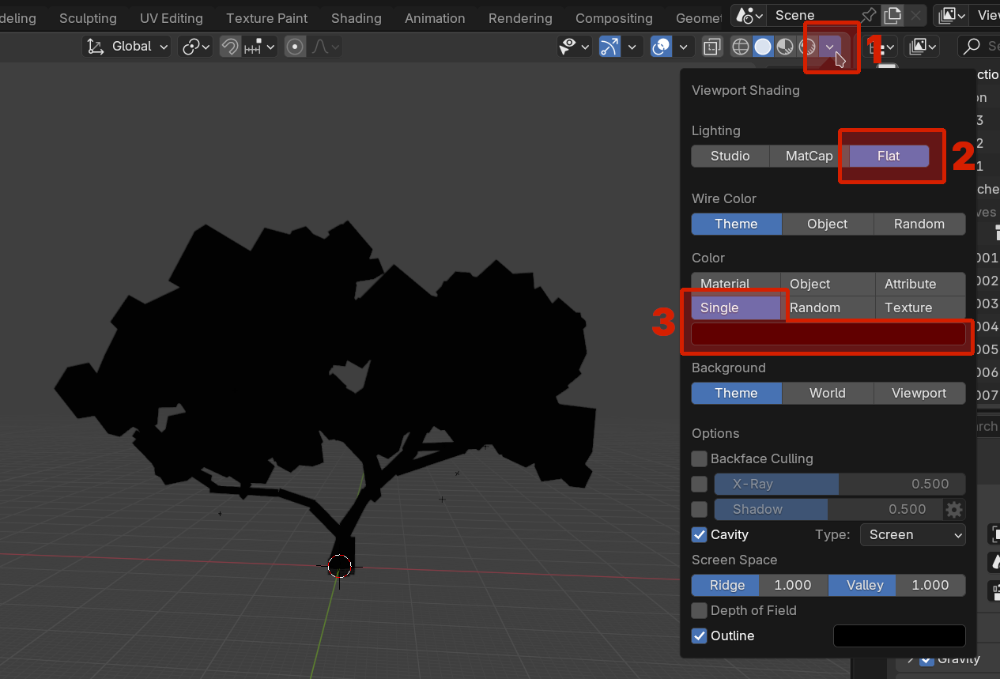

# Pierwsze zajęcia - blockout

Witaj na nowym kursie modelowania 3D w Blenderze. Mam nadzieję, że będzie stanowić on dobrą pomoc w trakcie twojej przygody tworzeniem twoich pierwszych modeli. Powodzenia!

## Wstępna konfiguracja
Przed rozpoczęciem warto skonfigurować Blender tak, aby jak najmniej przeszkadzał nam w naszej pracy. Z menu na samej górze programu wybierz `Edit` - `Preferences`. 

Przede wszystkim:

- zmień rozmiar UI jeżeli tego potrzebujesz
- **koniecznie** ustaw język na angielski jeżeli tak nie jest!
- poeksperymentuj z opcjami anti-aliasingu i hintingu dla bardziej czytelnego tekstu

Polska wersja językowa nie tylko nie jest dokończona, w niektórych miejscach jest po prostu błędna. Ponadto - wersja angielska jest uniwersalnym standardem. Korzystanie z wersji polskiej utrudni korzystanie z różnorodnych materiałów w sieci oraz paradoksalnie utrudni porozumiewanie się z innymi użytkownikami Blendera w Polsce.

## Interfejs Blendera

Interfejs Blendera opiera się o obszary, które możemy łączyć i dzielić. Domyślne to:

- 3D Viewport - nasz widok na scenę 3D
- Outlinera - pokazuje listę wszystkich obiektów na scenie
- Timeline - oś czasu wykorzystywana przy animacji. Na obecnych zajęciach można go pominąć
- Properties - właściwości zaznaczonego obiektu. Również można je teraz pominąć.

Warto nadmienić, że w nowszych wersjach Bledera dodano **Status Bar** (pasek na samym dole) pokazujący w co można w danej chwili kliknąć na myszce/klawiaturze. **Warto się na niego spojrzeć** jeżeli nie masz pewności jak postąpić dalej!

### Praca z obszarami

<video controls>
<source src="../../../assets/vid/blockout/tiling.webm" type="video/mp4">
</video>

Najeżdżając myszką na krawędź i wciskając lewy przycisk myszy jesteśmy w stanie tworzyć i łączyć obszary. Każdy z nich ma w lewym górnym rogu przycisk od wyboru zawartości. Można nim np. zamienić 3D Viewport na Outliner. Warto przejrzeć jakie obszary są dostępne (Blender ma nawet obszar od edycji wideo à la Adobe Premiere).

!!! example "Zadanie 1"
	Złącz wszystkie obszary tak, by pozostał tylko 3D Viewport. Następnie otwórz domyślne kafelki ponownie.
	
## 3D Viewport i Outliner
Nawigacja po widoku 3D wymaga znajomości kilku niezbędnych skrótów klawiszowych:

<video controls>
<source src="../../../assets/vid/blockout/basic_shortcuts.webm" type="video/mp4">
</video>

### Nawigacja po viewporcie
- `Scroll` - przybliżanie
- `Shift` + `A` - dodawanie obiektów
- `Scroll Btn` - obrót widoku wokół środka
- `Shift` + `Scroll Btn` - przesuwanie widoku
- `Ctrl` + `Scroll Btn` - przybliżanie widoku

### Interakcja z obiektami
- `Lewy przycisk myszy` - zaznaczanie
- `G` - przesuń obiekt
- `R` - obróć obiektem
- `S` - skaluj obiekt
- `X` - usuń obiekt

!!! note "Status Bar"
	W trakcie korzystania z tych narzędzi spójrz się na Status Bar. Pokażą ci się różne inne przyciski które możesz wcisnąć w trakcie używania narzędzia (np. `X`, `Y`, `Z` do wyrównania do osi).

### Dodatkowe skróty
- `B` - zaznacz prostokątem
- `C` - zaznacz kółkiem

### Kolekcje
Kolekcje to zbiory obiektów. W outlinerze domyślnie są już dwie kolekcje - `Scene Collection` i `Collection`. Możesz utworzyć nowe kolekcje klikając prawym przyciskiem myszy na outliner i wybierając opcję `New Collection`. Kolekcje można zagnieżdżać - tworzą one wtedy hierarchię reprezentowaną jako zwijalne drzewo w outlinerze. Warto segregować obiekty dodawane w Object Mode w kolekcje, aby uprościć ich wykorzystanie później.

!!! example "Zadanie 2"
	Ułóż losowe obiekty na scenie tak, aby utworzyć jakąś ciekawą, abstrakcyjną kompozycję. Nie musi to wyglądać realistycznie (przykłady zamieszczone pod spodem - nie musisz za nimi dokładnie podążać). Jeżeli zauważysz, że niektóre dodawane przez ciebie obiekty tworzą wspólną i logiczną całość, to dodaj je do kolekcji.

### Auto-depth
W trakcie wykonywania poprzedniego zadania można było zauważyć, że przybliżanie kamery do obiektów w pewnym momencie spowalnia. Jeżeli będziemy próbować dalej przybliżać mimo tego dojdzie do sytuacji, w której ruch kamery się zatrzyma a my będziemy musieli tyle samo cofać, żeby przywrócić kamerę do poprzedniej pozycji (bądź wcisnąć klawisz `.`). Powoduje to wrażenie zawieszenia się programu, podczas kiedy jest to wbudowane zachowanie które można wyłączyć.

Aby je wyłączyć należy wejść w `Edit` - `Preferences` - `Navigation` i zaznaczyć `Auto Depth`.

<video controls>
<source src="../../../assets/vid/blockout/auto-depth.webm" type="video/mp4">
</video>

## Terminologia
- Kształt - abstrakcyjny, dwuwymiarowy zarys
- Forma - abstrakcyjna, trójwymiarowa figura
- Obiekt - rzeczywisty byt (w programie do modelowania bądź w rzeczywistości)

## Co to jest blockout?
Blockout to luźne ułożenie obiektów na scenie tak, by przypominały to co chcemy zbudować. Nie obchodzi nas w tym realistyczny wygląd ani poprawna siatka modelu tylko chcemy mieć pogląd na ogólne proporcje. Korzystając z tej techniki nie będziemy musieli wychodzić z Object Mode w trakcie tworzenia naszych modeli.

## Praca z referencjami - model budy dla psa
Naszym pierwszym modelem będzie prosta buda dla psa.

Zacznijmy od analizy naszych referencji. Przede wszystkim - zależy nam na rozbicie skomplikowanego obiektu na jak najprostsze formy:

Nasz domek rozbijemy na prostopadłościan, dach i dodatkowe detale. Modelowanie detali wygląda tak samo jak modelowanie reszty - ponownie rozbijamy je na największe formy i detale. Proces powtarzamy tak długo, aż dojdziemy do wymaganego poziomu szczegółów.

!!! example "Zadanie 3"
	Zamodeluj/zrób blockout budy dla psa na podstawie podanych wyżej referencji
	
!!! note "Korzystanie z referencji"
	Nie musisz dokładnie trzymać się pojedynczej referencji. Wybieraj z różnych referencji takie detale, jakie ci się podobają tak, aby utworzyć jak najlepszy z twojego punktu widzenia model.

??? tip "Podpowiedź"
	1. Rozpocznij od zamodelowania ogólnego kształtu ścian. Zwróć uwagę na różną długość, szerokość i wysokość modelowanej budy
	
	2. Dodaj dach z dwóch ściśniętych prostopadłościanów. Zauważ, że dach wystaje poza ściany - nie jest z nimi zrównany!
	
	3. Dodaj pierwszą warstwę detali	
	
	4. Zauważ, że na referencjach buda dla psa jest zbudowana z desek. Zauważ też, że deski są względem siebie lekko przechylone, aby jedna mogła wejść pod drugą. Zamodeluj w ten sposób dach
		
	5. Zamodeluj również deski na ścianach. Pamiętaj, że deski mogą wchodzić w inne obiekty (przydatne w trakcie modelowania prostokątnych desek przy trójkątnym dachu) - w finalnym widoku i tak nie będzie tego widać.
	
	
	Nasz model jest gotowy! :)
	
## Asset browser
Jeżeli utworzony przez nas model nas zadowala i uznajemy że jest gotowy możemy go zamienić na asset. Łatwo zauważyć, że gdy klikamy w jakiś obiekt na viewportcie w Object Mode to nie zaznacza nam się cała kolekcja, tylko dokładny obiekt w który kliknięto. Zamiana modelu na asset pozwoli korzystać z niego jako z jednej, wspólnej całości.

<video controls>
<source src="../../../assets/vid/blockout/asset-browser.webm" type="video/mp4">
</video>

## Bardziej skomplikowane obiekty
Wedle poprzedniej zasady można również rozbijać bardziej skomplikowane obiekty, których formy nie są natychmiastowo oczywiste. Weźmy jako przykład drzewo:

Jesteśmy w stanie okrągły kształt opisać kanciastymi formami (w tym przypadku - opisujemy pojedyncze kłęby liści korony drzewa prostopadłościanami). To od nas zależy wybór poziomu detali (porównaj czerwone z żółtym). Zauważ, że żółte prostopadłościany generalnie zawierają się w czerwonych - detale *rozwijają* główne formy, a nie je zastępują.

## Modelowanie drzewa

!!! example "Zadanie 4"
	Zamodeluj/zrób blockout budy drzewa na podstawie podanych wyżej referencji. W trakcie modelowania kładź większy nacisk na ogólną sylwetkę/kształt modelu niż na samą formę liści.

??? tip "Podpowiedź 1 - analiza referencji"
	Obserwacje:

	- drzewa nie idą prosto do góry - **przechylają się**
	- jest dużo gałęzi - nie tylko trzy główne, ale również wchodzące w nich skład rozgałęzienia
	- gałęzie nie idą tylko do góry, mogę iść też w bok 
	- gałęzie są duże, o wiele bardziej przerastające pień
	- **proporcje**: wysokość drzewa = 6x wysokość pnia
	- gałęzie robią "**zygzag**"
	- poszczególne trzony gałęzi nie kończą się są tej samej wysokości
	- pień jest niejednolicie gruby
	- korzenie, pień i gałęzie tworzą jedną, "zawijającą się" całość
	- **samopodobieństwo**: rozgałęzienie jest podobne do reszty drzewa

??? tip "Podpowiedź 2 - proces modelowania"
	Zamodeluj pień pamiętając o tym, że składa się z "zawijających się" głównych gałęzi drzewa
	
	

	Wydłuż główne gałęzie tak aby proporcje pnia do gałęzi się zgadzały. Następnie dodaj rozgałęzienia
	
	
	
	!!! note "Samopodobieństwo gałęzi"
		Zauważ, że rozgałęzienia są podobne do reszty drzewa. Nie musisz więc modelować każdego z osobna - możesz kopiować części drzewa (np. za pomocą box select) a następnie wklejać i przeskalowywać tak, aby wyglądały jak rozgałęzienie.
		
	Zamodeluj główne masy liści, a następnie dodaj formy poboczne
	
	

	!!! note "Samopodobieństwo liści"
		Zasadę samopodobieństwa można rozszerzyć do całych liści. Jeżeli w małym fragmencie modelu kłęby liści są podobne do całości to można zmniejszyć przygotowaną przez nas koronę aby uzyskać mniejszy kłębek liści zawierający więcej detali.
		
	Wykorzystaj asset browser do utworzenia nowego modelu kłębka liści z wykonanej wcześniej korony. Następnie użyj tego assetu do ponownego zamodelowania głównych mas liści na drzewie (tip: duplikowanie przeniesionych assetów za pomocą `Shift` + `D` znacząco zwiększa szybkość pracy)
	
	<video controls>
	<source src="../../../assets/vid/blockout/tree_asset.webm" type="video/mp4">
	</video>
	
	
	
### Podgląd sylwetki
Aby podejrzeć sylwetkę naszego modelu należy wejść w menu cieniowania viewportu (1), następnie zmienić oświetlenie na płaskie (2) i jego kolor na pojedynczą wartość ustawioną na kolor czarny (3). Dostaniemy wtedy widok czarnej sylwetki.

Jeżeli chcemy przywrócić poprzednie oświetlenie wystarczy zmienić (1) z powrotem na `Studio`.

### Porównanie poziomów detali

Zauważ, że wystarczyła jedna iteracja wykorzystania samopodobieństwa w liściach żeby znacząco zwiększyć poziom detalu. Widoczne jest jasne przejście od bardzo kanciastej masy do sylwetki, która faktycznie przypomina drzewo. Co ciekawe, budowania masy liści z samych prostopadłościanów już po pierwszej iteracji dodawania detali jej sylwetka wygląda "okrągło".

!!! example "Zadanie 5"
	Utwórz asset z wykonanego wcześniej drzewa, następnie zrób na jego podstawie mały sad i sprawdź jego sylwetkę.

## Bonus - Kitbashing
Poznane dziś umiejętności blockoutu można również wykorzystać w bardziej zaawansowanej formie. Istnieją tzw. *asset libraries* zawierające gotowe części do tworzenia większych modeli. Ponieważ te części nie są tak prymitywne jak używane przez nas do tej pory domyślne figury jesteśmy w stanie z nich złożyć model który nie tylko ma dobrą sylwetkę, ale również dobrze wygląda. Ta technika to tzw. *kitbashing*.

### Biblioteki assetów
Blender posiada domyślną ścieżkę w której szuka różnych bibliotek. Można ją sprawdzić wchodząc w `Edit` - `Preferences` - `File Paths`. W sekcji `Asset Libraries` znajduje się pole `Path` zawierające domyślną ścieżkę wykorzystywaną przez Blender.

!!! warning "Uwaga!"
	Powyższa ścieżka może się różnić między urządzeniami i systemami.

!!! warning "Uwaga!"
	Powyższa ścieżka niekoniecznie musi istnieć (np. w `Documents` nie ma katalogu `Blender`). W takim wypadku należy utworzyć brakujące katalogi tworzące tą ścieżkę.

Jeżeli przeniesiemy do tego katalogu plik `.blend` zawierający żądane przez nas assety będziemy w stanie z nich skorzystać w każdym innym miejscu. Taki plik to wspomniany wcześniej asset library.

!!! example "Zadanie 6"
	Przenieś plik <a href="../../../assets/blend/mech-kit.blend">mech-kit.blend</a> do swojego katalogu z assetami. Następnie znajdź stosowne referencje w internecie i zbuduj własnego mecha. Powodzenia!
