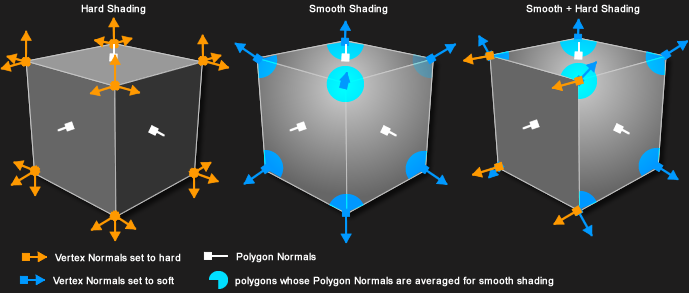
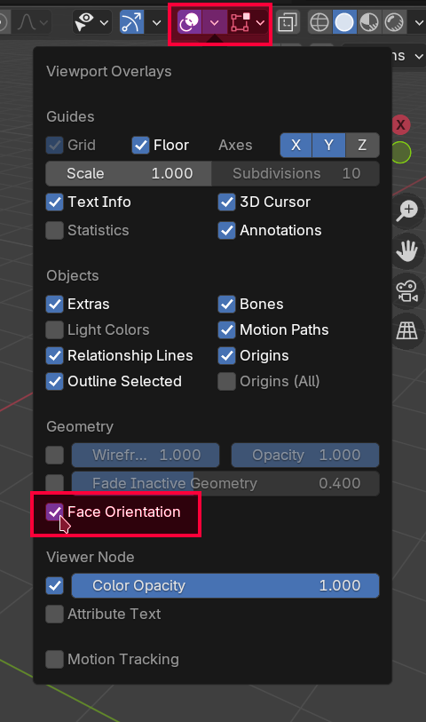

# Box modeling - podstawy

!!! note "Zakres materiału"
	Materiał w tym rozdziale obejmuje dwa spotkania kursu Blendera.

## Wstępna konfiguracja
### Ilość cofnięć
W trakcie modelowania zależy nam na jak największej elastyczności. Będziemy polegać w dużej mierze na operacji cofania. Domyślny limit 32 cofnięć szybko okaże się niewystarczający. Można go zwiększyć w menu `Edit` - `Preferences` - `System` - `Undo Steps`. Ustaw ilość na 256.

!!! warning "Uwaga!"
	Ilość dostępnych cofnięć wpływa na zużycie pamięci RAM

### Autosave
Blender automatycznie zapisuje twoje postępy co dwie minuty. Warto zmniejszyć odstęp zapisywania do minuty aby ograniczyć szkody w wypadku nagłego crashu programu.

### Viewport Shading
Ponieważ będziemy pracować przez większość czasu w obszarze 3D Viewport warto zmienić cieniowanie na bardziej wyraźne. W zakładce Viewport Shading wybierz MatCap a następnie zaznacz taki, który ci najbardziej odpowiada (polecam `clay_studio.exr`, nazwa MatCapu jest widoczna po najechaniu na niego myszką i poczekaniu na dymek). Zaznacz również opcję "Cavity" która sprawia, że kontury twojego modelu będą posiadały wyraźniejszy obrys.

## Podstawy edit mode
W Edit Mode powtarzają się narzędzia z Object Mode. W szczególności - działają skala, rotacja, translacja i zaznaczanie. Tym razem jesteśmy jednak w stanie operować nie per obiekt, lecz per wierzchołek.

### Object mode vs Edit mode
!!! warn "Dodawanie geometrii"
	W edit mode również można korzystać z menu Add, jednakże dodawana geometria dołączana jest do obecnego obiektu. Nie jest tworzony nowy obiekt - nie zobaczymy go w outlinerze!
	
!!! warn "Skalowanie"
	Skala nadana w Object Mode wpływa na narzędzia w Edit Mode! Jeżeli obiekt nie jest przeskalowany jednolicie (np. przeskalujemy tylko po osi X) to każda transformacja jaką będziemy próbować wykonać w Edit Mode będzie się wydawać rozciągnięta!
	W Blenderze 4.4 jeżeli nałożymy niejednolitą transformację w Object Mode to otrzymamy ostrzeżenie w status barze. Jest to pomocne gdy np. Bevel ucina nasz mesh w niejednolity sposób.

    

## Składowe modelu 3D
- Model 3D opisany jest przez **siatkę** (**mesh**)
- Siatka składa się ze **ścian** (**faces/polygons/polys**)
- Ściany składają się z **krawędzi** (**edges**)
- Krawędzie składają się z **wierzchołków** (**vertex/vertices**)

- Wierzchołki dodatkowo posiadają **normalne** (**normals**) opisujące sposób cieniowania. Dokładny opis normalnych znajduje się w dalszej części materiału.

- Ściany mogą być:
    - Trójkątami (triangle - **Tri**)
    - Czworokątami (quadrilateral - **Quad**)
    - Wielokątami (**N-Gon**)

- Sąsiednie ściany złożone z quadów tworzą pętle. Można je zaznaczać najeżdżając na pożądaną krawędź i klikając `Alt` + `Lewy Przycisk Myszy`.

- Jeżeli analizujemy sposób ułożenia pętli z punktu widzenia ścian to mówimy o **Poly Flow**

- Jeżeli analizujemy sposób ułożenia pętli z punktu widzenia krawędzi to mówimy o **Edge Flow**

!!! note "Zapamiętaj"
    Pętle utworzone są z quadów.

!!! note "Topologia modelu"
	Sposób połączenia wierzchołków modelu krawędziami i wynikające z niego pętle nazywane są **topologią modelu**.

## Narzędzia box modelingu
### Extrude
- Skrót: `E`

Extrude (wytłaczanie) wyciąga zaznaczoną przez nas ścianę do przodu, a wokół niej kładzie nową pętlę geometrii.

### Inset
- Skrót: `I`

Inset przenosi zaznaczoną przez nas ścianę do środka, a wokół niej kładzie nową pętlę geometrii.

!!! tip "Uwaga!"
	Na obecnych zajęciach Inset będzie głównym narzędziem do ręcznego dodawania przez nas pętli.

### Loop Cut
- Skrót: `Ctrl` + `R`

Loop Cut przecina wybraną przez nas pętlę poligonów na wiele mniejszych pętli. Możemy kontrolować ilość przecięć za pomocą przesuwania `Scroll` na myszce.

!!! warning "Uwaga!"
	Loop Cut działa tylko na pętlach, wymaga więc od nas pracowania na geometrii bazującej na quadach.
	
!!! warning "Loop Cut przechodzi przez cały mesh"
	W przeciwieństwie do Inset który dodaje zlokalizowany detal zamknięty w zaznaczonych ścianach, pętle tworzone przez Loop Cut przechodzą przez cały mesh.

### Bevel
- Skrót: `Ctrl` + `B`

Bevel zaokgrągla zaznaczoną przez nas krawędź poprzez dodanie geometrii do pętli, na której ona leży.

!!! warning "Bevel może zniszczyć topologię"
	Bevel zmienia ilość krawędzi na bocznych ścianach. Zauważ, że na przykładowym zdjęciu ściana boczna będąca quadem się zmieniła w n-gon (siedmiokąt)!

!!! warning "Bevel przerywa pętle"
	Zmiana quada na n-gon przez Bevel przerwała pętlę, której ten quad był częścią.
	
!!! tip "Kiedy Bevel jest bezpieczny"
    Bevel niszczy topologię opartą o quady, jeżeli użyjemy go na niedomkniętej pętli krawędzi (np. gdy zaznaczymy pojedynczą krawędź i zignorujemy jej sąsiadów). Jeżeli pętla krawędzi jest domknięta gdy wciśniemy `Ctrl` + `B` to Bevel utworzy same nowe quady.

	

### Bridge Faces (Loft)
- Przycisk: `Prawy przycisk myszy` - `Bridge Faces` bądź `Bridge Edge Loops` w zależności od trybu wyboru geometrii (krawędzie vs ściany)

Bridge Faces łączy zaznaczone przez nas ściany generując między nimi nowe pętle poligonów.

Jednym z głównych zastosowań tego narzędzia jest również przebijanie dziur w meshu.

!!! tip "Bridge Faces + Inset = ❤️"
	Narzędzie Inset idealnie się nadaje do wydzielenia ścian służących do przebicia dziury w ramach Bridge Faces

### Proportional editing
- Skrót: `O`

Tryb edycji proporcjonalnej pozwala na manipulację wieloma wierzchołkami na raz znajdującymi się w zadanym obszarze. Rozmiar tego obszaru można kontrolować przesuwając `Scroll`.

<video controls>
<source src="../../../assets/vid/box-modeling/basic-tools/proportional-editing.webm" type="video/mp4">
</video>

## Dodatkowe narzędzia
- `G` + `G` - edge slide - pozwala przesuwać pętle krawędzi
- `Ctrl` + `F`, `Grid Fill` - wypełnia zaznaczoną pętlę krawędzi siatką quadów o ile jest to możliwe. Po wybraniu grid fill w lewym dolnym rogu jest menu które pozwala na "obrót" wynikowej geometrii (parametr offset) w celu jej wyrównania.

	!!! warning "Uwaga!"
	    Częstą sytuacją w której wykorzystujemy grid fill jest pozbycie się n-gona z góry cylindra, aby móc następnie przecinać ten cylinder za pomocą narzędzia loop cut. Jeżeli nie wyrównamy wynikowej geometrii za pomocą parametru offset to zmienimy edge flow i tym samym dodawane przez nas pętle nie zamkną się w oczekiwanym miejscu!

	    
		
		Przykład: próba użycia loop cut na wyrównanym vs niewyrównanym grid fill. Zwróć uwagę na górną a dolną ścianę (offset między nimi różni się tylko o 1). Na obu rysunkach kolorem zaznaczono poly flow pomiędzy podstawą a ścianami bocznymi.
		
- `Alt` + `Z` - X-ray mode - widok przezroczysty, pozwalający zobaczyć wnętrze mesha. Aby z niego wyjść należy ponownie wcisnąć `Alt` + `Z`.
- `Klawisz tyldy` - wyrównanie kamery do wybranej osi

!!! tip "Pętle, pętle, pętle!"
	Jak widać w powyższych sekcjach większość informacji dotyczyła sposobu ułożenia nowych pętli w modelu. Traktuj modelowanie 3D jako naukę/sztukę o łączeniu różnych pętli ze sobą, żeby uzyskać wymagany rezultat. Planowanie pętli jest *kluczowe* do uzyskania dobrego modelu i nie pogubienia się z modelowaniem!

## Ćwiczenie - freestyle
!!! example "Zadanie 1"
	Dodaj losowe obiekty na scenę i przetestuj na nich wszystkie poznane narzędzia po kolei. Zbuduj abstrakcyjną scenę.

## Smooth shading
Nasze modele nie wyglądają gładko - gdy się na nie patrzymy widzimy dokładnie gdzie się rozpoczynają i kończą ściany. Możemy próbować zwiększyć ich liczbę w modelu, lecz zwiększamy w ten sposób znacząco liczbę geometrii. Ponadto, jak zbliżymy się zbytnio do obiektu to pojedyncze ściany będą znowu widoczne.

Jesteśmy w stanie jednak zmienić sam sposób cieniowania na tzw. "smooth shading". Kliknij prawym na dowolny obiekt w Object Mode a następnie wybierz opcję "shade smooth" żeby zobaczyć efekt.

### Problemy smooth shading
O ile na wybranym wyżej UV Sphere smooth shading wygląda dobrze sprawa się zmienia gdy wybierzemy bardziej kanciasty model. Sprawdźmy jak smooth shading będzie wyglądał dla cylindra...

Wynikowe cieniowanie jest dziwne - jest gładkie przejście między ścianami bocznymi a podstawami, mimo że między nimi jest kąt 90 stopni. Całość wygląda jakby Blender próbował cieniować cylinder jak gładką sferę mimo że nią nie jest. Dlaczego tak się dzieje?

### Normalne
We wcześniejszej sekcji wspomniano, że model poza wierzchołkami posiada również normalne, które odpowiadają za cieniowanie. Są one kluczem do zrozumienia tego co się właśnie stało. Aby włączyć widok normalnych należy w Edit Mode wejść w `Mesh Edit Mode Overlays` i zaznaczyć `Display Split Normals`.

Po kliknięciu we wskazane na zdjęciu przycisku we viewporcie przy każdym wierzchołku pokażą się nasze normalne.

### Normalne wierzchołkowe (Vertex normals)

!!! note "Uwaga"
	Nie musisz rozumieć tej sekcji w całości ani znać jej na pamięć żeby korzystać z Blendera. Służy ona przedstawieniu niskopoziomowych źródeł problemu, z którym mamy styczność w programie.

W matematyce normalna oznacza wektor (zwykle unormowany) prostopadły do ściany. Z fizyki możemy pamiętać, że jeżeli znamy normalną do powierzchni i wektor promienia światła to możemy obliczyć jasność tej powierzchni na podstawie prawa Lamberta.

Na zdjęciu jednak różowe wektory nie są ani prostopadłe ani przypisane do ściany tylko do wierzchołków.

Dzieje się tak dlatego, że normalne w grafice komputerowej nie dotyczą tak naprawdę modelowanej powierzchni, tylko hipotetycznej, wirtualnej z pożądanym przez nas cieniowaniem.

Aby jeszcze bardziej namieszać nam w głowie porównajmy jak wyglądają normalne w cieniowaniu płaskim vs w cieniowaniu gładkim.

W cieniowaniu płaskim każdy wierzchołek posiada wiele normalnych... co?

### Cieniowanie Phonga
Łatwo zauważyć na zdjęciu wyżej, że w płaskim cieniowaniu każdy wierzchołek ma tyle normalnych, ile jest obok ścian. Dzieje się tak dlatego, że w ramach przetwarzania pojedynczej ściany przez kartę graficzną z wierzchołka będzie brana ta normalna, która tej ściany dotyczy.

Renderer viewportu Blendera (czyli kod, który go wyświetla) pobiera dla każdej ściany normalne z każdego wierzchołka, a następnie interpoluje je w każdym pikselu po kolei. Dzięki temu jesteśmy w stanie stosować prawo Lamberta per-piksel, a nie per całą powierzchnię co pozwala na późniejsze uzyskanie wygładzonego cieniowania.

Na powyższym obrazku kolorem szarym została zaznaczona wirtualna powierzchnia idealnego cieniowania. Interpolowane normalne są do niej faktycznie prostopadłe. Dzięki temu patrząc się na UV sphere po smooth shadingu mamy wrażenie, że wewnątrz niej jest nieskończenie wiele geometrii. Cieniowanie nie dotyczy UV sphere, tylko idealnie gładkiej hipotetycznej sfery!

!!! note "Flat shading"
    Flat shading w Blenderze dla każdego wierzchołka przypisuje normalne (definicja matematyczna) sąsiednich ścian. W trakcie przetwarzania pojedynczej ściany interpolowana więc będzie ciągle ta sama normalna. W ten sposób każdy piksel będzie miał ten sam kolor na mocy prawa Lamberta.
	
!!! note "Smooth (Phong) shading"
    Gdy wybierzemy smooth shading normalne wierzchołkowe są uśredniane do jednej, ogólnej normalnej (dlatego w interfejsie widoczna jest tylko jedna normalna niebędąca prostopadła do żadnej z sąsiednich ścian). Te podejście to tzw. **cieniowanie Phonga**.

## Naprawianie częstych problemów z cieniowaniem
### Smooth shading - holding edges
Co powinniśmy wynieść z poprzednich sekcji? Jakie informacje nam pomogą w naprawie cieniowania?

!!! note "Normalne a cieniowanie"
    Cieniowanie opiera się o normalne na wierzchołkach. Pamiętajmy, że to my kontrolujemy rozmieszczenie wierzchołków w programie!

!!! note "Przyczyna złego cieniowania"
    Dziwne efekty widziane w ramach operacji shade smooth są wynikiem uśredniania normalnych przypisanych do wierzchołków.
	
Jeżeli to my kontrolujemy geometrię, to z punktu widzenia użytkownika Blendera wystarczy wymusić, żeby normalne uśredniały się do wartości podobnych we flat shadingu. Musimy więc dodać jakąś geometrię. Krawędzie dodawane do wymuszenia odpowiedniego uśredniania to tzw. **holding edges**.

W przypadku naszego cylindra - wystarczy dodać loop cut obok krawędzi oraz inset, aby naprawić w tym rejonie normalne. Na obrazku dodane krawędzie zostały zaznaczone na zółto.

!!! example "Zadanie 2"
	Dodaj kostkę na scenę i ustaw jej cieniowanie na Smooth. Następnie napraw je za pomocą techniki holding edges.

### Odwrócone normalne
Istnieje sporo sytuacji, w których możemy się natknąć na tzw. "odwrócone normalne". Powodują one odwrócone cieniowania (oświetlone ściany stają się ciemne, ściany w cieniu stają się jasne).

Aby sprawdzić obecność odwróconych ścian należy włączyć odpowiedni overlay we viewportcie klikając w `Viewport Overlays` - `Face Orientation`.

Jeżeli nasz mesh nie posiada odwróconych normalnych to nic się nie zmieni. W przeciwnym wypadku złe ściany zostaną zaznaczone na czerwono.

!!! tip "Face Orientation Overlay"
    Od tej pory warto mieć ten overlay zawsze włączony - będziemy dzięki niemu natychmiast wiedzieć kiedy natrafiliśmy się na odwrócone normalne.
	
Poniżej zostały podane przykłady tworzenia geometrii z odwróconymi normalnymi i główny sposób ich naprawy.

!!! warning "Odwrócone normalne za pomocą extrude"
	Na odwrócone normalne bardzo łatwo jest się natrafić, jeżeli będziemy wytłaczać pojedyncze krawędzie.
	
	<video controls>
	<source src="../../../assets/vid/box-modeling/shading/extrude.webm" type="video/mp4">
	</video>

!!! warning "Odwrócone normalne za pomocą skalowania"
	Odwrócone normalne możemy również uzyskać, jeżeli przeskalujemy cały obiekt przez ujemną wartość

	<video controls>
	<source src="../../../assets/vid/box-modeling/shading/scale.webm" type="video/mp4">
	</video>

!!! tip "MatCap vs Studio Lighting"
	Na nagraniach od razu było widać problemy z cieniowaniem nawet bez włączania Face Orientation Overlay, ponieważ ustawiony był wcześniej MatCap (patrz: wstępna konfiguracja). **Studio Lighting (domyślne oświetlenie) nie pokazuje nam problemów z cieniowaniem!**

!!! note "Naprawianie odwróconych normalnych"
	Aby naprawić odwrócone normalne należy obliczyć je ponownie. W tym celu zaznacz cały mesh za pomocą `A` i wykonaj operację `Recalculate Outside` (skrót: `Shift` + `N`, można również wyszukać za pomocą `F3`) 

## Przygotowanie do modelowania
### Ogólne porady
- Niech twój model posiada pewną bazową gęstość geometrii.
- Nie przesadzaj z ilością geometrii - używaj jej tyle, ile potrzeba.
- Zaplanuj twoje pętle przed modelowaniem
- Formy "odstające" powinny posiadać wokół siebie pętle
- Unikaj trójkątów i n-gonów
- W razie możliwości wyrównuj geometrię do osi

  Oczywiście od każdej z tych zasad istnieją odstępstwa, nie będziemy się teraz w nie jednak zagłębiać.

!!! note "Skąd się biorą te porady?"
    Źródło tych porad poznamy na przyszłych zajęciach. Nie posiadamy obecnie jeszcze narzędzi, żeby te porady w pełni wyprowadzić.

### Stylizacja
!!! note "Definicja"
	Stylizacja to uproszczenie bądź wyolbrzymienie form w celu uzyskania pożądanego efektu wizualnego.

Na obecnych zajęciach przyjmiemy stylizację low-poly, ponieważ w tym momencie nie znamy reszty narzędzi do budowania modelów z wysoką ilością detali. Gdy będziesz tworzyć własne modele warto zastanowić się nad rodzajem stylizacji, który pomoże ci uzyskać szybko rezultaty.

!!! warning "Uwaga!"
	Uwaga! Stylizacja *nie jest* lekarstwem na wszystko. To tylko jedno z narzędzi, z jakich artysta może skorzystać. Przede wszystkim artysta powinien być zawsze w kontroli, a stylizacja powinna być świadomą decyzją. **Nie traktuj stylu jako wymówki aby ominąć naukę tego, czego obecnie nie umiesz!**
  
### Modelowanie z symetrią - modyfikator mirror
Spora część obiektów z jakimi wchodzimy w interakcję na co dzień posiada symetrię. Wykorzystując symetrię w modelowaniu 3D skrócimy sobie pracę o połowę - w końcu będziemy musieli modelować tylko jedną stronę obiektu. Ponadto, obie strony będą dzięki temu idealnie równe.

Aby wykorzystać symetrię w modelowaniu należy przeciąć obiekt w pół i dodać modyfikator Mirror. W tym celu w obszarze Properties wybierz zakładkę Modifiers (ikona klucza ślusarskiego) a następnie kliknij `Add Modifier` i zacznij pisać "mirror" aby wyszukać stosowny modyfikator.

<video controls>
<source src="../../../assets/vid/box-modeling/mirror/mirror.webm" type="video/mp4">
</video>

!!! note "O modyfikatorach"
	Nie będziemy się teraz zagłębiać w to czym jest modyfikator. Poznamy je jednak dokładniej w późniejszych zajęciach. Symetria jest tak bardzo przydatna, że warto z niej korzystać nawet nie wiedząc jeszcze czym jest modyfikator.

Domyślnie obie połówki odbijanego mesha nie są sklejone. Jeżeli spróbujemy poruszyć wierzchołkami bądź całym meshem z dala od płaszczyzny odbicia to rozerwiemy nasz mesh. Aby mesh był sklejony należy w opcjach nałożonego modyfikatora zaznaczyć "Clipping".

<video controls>
<source src="../../../assets/vid/box-modeling/mirror/clipping.webm" type="video/mp4">
</video>
	
## Modelowanie kubka
!!! example "Zadanie 3"
	Przeanalizuj referencje i zamodeluj na ich podstawie kubek. Zwróć uwagę na miejsca, które będą wymagać rozmieszczenia głównych pętli.

!!! note "Porada - umieszczanie pętli"
	Umieszczaj na modelu pętle znalezione na bazie referencji za pomocą narzędzia Inset.
	
??? tip "Podpowiedź 1 - Analiza referencji"
	- Zaokrąglone krawędzie. Obiekt jest trzymany w dłoni - nie może jej drapać/ciąć
	- Proporcje: ucho zajmuje 1/2 wysokości
	- Kubek zawęża się w dół
	- Odstające formy (dla każdej z nich potrzebna pętla):
		- ucho
	- Istnieje płynne przejście między uchem a resztą kubka. Powinien on być więc modelowany jako jeden obiekt w Edit Mode, a nie jako wiele w Object Mode
	
??? tip "Podpowiedź 2 - Główne pętle kubka"
	

??? tip "Podpowiedź 3 - Modelowanie krok po kroku"
	Dodaj cylinder i dopasuj wymiary (w edit mode, nie w object mode!) do proporcji referencji
	
	
	
	Usuń n-gony na cylindrze - wypełnij przestrzeń między pętlami za pomocą narzędzia grid fill. Pamiętaj o wyrównaniu wynikowej geometrii do osi za pomocą parametru offset.

		

	Wyrównaj gęstość geometrii na powierzchni bocznej cylindra za pomocą narzędzia loop cut (ściany powinny wyglądać jak kwadraty). Następnie zaznacz grubość ścian kubka za pomocą inset tak aby pasowała do referencji i wytłocz dziurę w kubku za pomocą extrude. Pamiętaj o wyrównaniu gęstości geometrii wewnątrz kubka!

	

	Zawęź kubek za pomocą trybu proportional editing tak aby pasował do referencji

	
	
	Dodaj pętlę od formy ucha kubka. Chcemy móc później użyć symetrii za pomocą modyfikatora mirror, co będzie wymagało przecięcia kubka w pół. Upewnij się teraz, że dodana pętla jest wyrównana z jakąś osią

	
	
	Wytłocz formę od ucha. Wyrównaj na niej gęstość geometrii

	

	Dodaj pętlę od grubości ucha. Następnie przebij tę formę za pomocą narzędzia bridge edge loops/bridge faces

	
	
	Przetnij kubek w pół i nałóż modyfikator mirror
	
	
	
	Wymodeluj kształt ucha za pomocą proportional editing i ręcznego przesuwania geometrii. Przesuwaj i usuwaj pętle na uchu w razie potrzeby.
	
	
	
	Zaokrąglij stosowne krawędzie kubka za pomocą narzędzia bevel

	

	Dodaj spód kubka

	
	
	Nasz model jest już gotowy!

	

## Modelowanie krzesła
!!! example "Zadanie 4"
	Przeanalizuj referencje i zamodeluj na ich podstawie krzesło. Ponownie - zwróć uwagę na miejsca, które będą wymagać rozmieszczenia głównych pętli.

??? tip "Podpowiedź 1 - Analiza referencji"
	- Proporcje: wysokość krzesła jest 2x większa od długości i szerokości
	- Proporcje: połowa wysokości to oparcie, a połowa to nogi
	- Nogi krzesła odstają od środka - nie są prostopadłe do ziemi
	- Oparcie się rozszerza u góry i również nie jest prostopadłe do ziemi
	- Oparcie jest wygięte w tył
	- Siedzenie również może być wygięte w dół
	- Siedzenie jest zaokrąglone
	- Odstające formy (dla każdej z nich potrzebna pętla):
		- oparcie
		- deska nad nogami
		- nogi
		- deski między nogami

??? tip "Podpowiedź 2 - Modelowanie krok po kroku"
	Rozpocznij od modelowania siedzenia. Nadaj tyle geometrii za pomocą loop cut, aby móc później dodać pętle od nóg
	
	
	
	Dodaj pętle od desek nad nogami 
	
	
	
	Dodaj pętle od nóg
	
	
	
	Dodaj pętle od podparcia
	
	
	
	Podziel model na pół i wykorzystaj modyfikator mirror

	
	
	Dodaj geometrię tak, aby można było dodać pętle od otworów w podparciu

	
	
	Dodaj pętle od otworów

	

	Dodaj detale do podparcia
	
	
	
	Na referencji nogi są okrągłe. Dodaj pętle, aby podstawą nogi nie był kwadrat tylko ośmiokąt. Następnie wykorzystaj dodaną geometrię, żeby zaokrąglić nogi.
	
	
	
	Zauważ, że dodając te pętle wyrównaliśmy również gęstość geometrii na siedzeniu. Oddal nogi krzesła od środka modelu. Możesz użyć do tego narzędzia scale.
	
	
	
	Dodaj na nogach pętle od połączenia z deskami między nimi
	
	
	
	Dodaj deski według utworzonych poprzednio pętli. Zaznacz następnie pętlę od środkowej deski i również ją utwórz.
	
	
	
	Przy dodawaniu geometrii na granicy modyfikatora mirror należy uważać na ściany wewnątrz ścian. Zobacz czy u ciebie nie ma takiej geometrii za pomocą widoku x-ray. Jeżeli jest to ją usuń.
	
	
	
	Dodaj brakujące detale do nóg i do siedzenia. Pamiętaj o zakrzywieniu powierzchni za pomocą trybu proportional editing, oraz o zaokrągleniu za pomocą bevel.

	

## Modelowanie parasola
!!! example "Zadanie 5 - praca domowa"
	Przeanalizuj referencje i zamodeluj parasol.

	
!!! note "Porada 1"
	Sprawdź obiekty dostępne w menu Add. Wybierz ten, który uważasz za najbliższy parasolowi

!!! note "Porada 2"
	Jeżeli obiekt składa się z wielu części w prawdziwym świecie, to można go zamodelować korzystając z wielu obiektów i modelując każdy z nich osobno.
