# Modelowanie organiczne. Deformacje

## Wstęp

W ramach poprzednich zajęć opanowaliśmy podstawowe narzędzia Edit Mode, w tym tryb edycji proporcjonalnej który pozwalał na poruszanie (deformację) wielu wierzchołków na raz.

Na obecnych zajęciach poznamy Sculpt Mode - tryb edycji pozwalający na bardziej wyrafinowaną i intuicyjną deformację wierzchołków. Aby do niego przejść należy zmienić tryb edycji w obszarze viewportu.

## Sculpt Mode

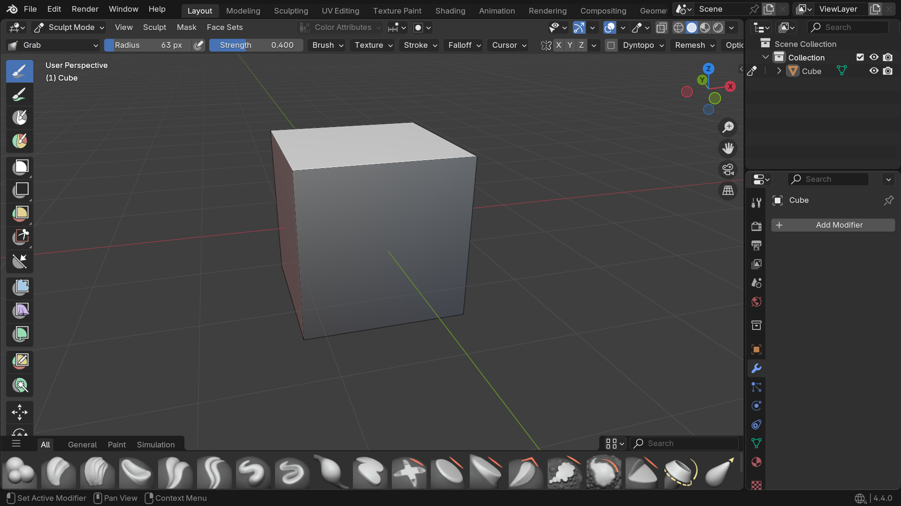

!!! warning "Wyłącz Dyntopo"
	Upewnij się, że opcja "Dyntopo" jest **odznaczona**!
	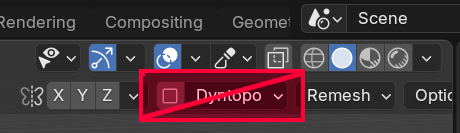
	
	Dokładne działanie tej opcji zostanie wyjaśnione na przyszłych zajęciach. Wiedz tylko, że **niszczy topologię**.	

Główna rzecz którą dodaje Sculpt Mode to pasek pędzli na dole ekranu. Każdy z nich posiada ilustrację pokazującą główne działanie oraz dokładniejszy opis po najechaniu myszką.

!!! example "Zadanie 1"
	Dodaj na scenę Cube jeżeli go nie ma i przetestuj bezpośrednio na nim pędzle w Sculpt Mode
	
	<video controls>
		<source src="../../assets/vid/organic-modeling/sculpting-geometry/sculpt-no-geometry.webm" type="video/mp4">
	</video>`

Możesz zauważyć, że na domyślnej kostce te pędzle nie robią nic widocznego. Dzieje się tak dlatego, że jest na niej zbyt mało geometrii. Pędzle nie mają więc z czym działać.

!!! note "Sculpt mode a geometria"
	Sculpt Mode jako pomoc dla Edit Mode nie tworzy nowej geometrii, tylko pracuje na istniejącej.
	
Aby przetestować sculpt mode należy utworzyć mesh o większej ilości geometrii. Można to zrobić m.in. poprzez podzielenie istniejącego już mesha na więcej ścian. Należy w tym celu w Edit Mode zaznaczyć ściany które chcemy podzielić, następnie kliknąć na nie prawym przyciskiem myszy i wybrać z menu Subdivide.

!!! example "Zadanie 2"
	Dodaj na scenę nowy Cube. Nałóż na niego stosownie duże subdivision (np. 20) i przetestuj na nim pędzle ze Sculpt Mode.

	<video controls>
		<source src="../../assets/vid/organic-modeling/sculpting-geometry/sculpt-with-geometry.webm" type="video/mp4">
	</video>`
	
## Podstawowe pędzle
Łatwo zauważyć że Sculpt Mode posiada sporo pędzli. W tej sekcji skupimy się jednak na tych najbardziej przydatnych z punktu widzenia modelowania i współpracy z Edit Mode.

!!! note "Rozmiar i siła pędzla"
    Wewnątrz Sculpt Mode możemy zmienić rozmiar pędzla za pomocą `F` oraz zmienić siłę jego działania za pomocą `Shift` + `F`.

### Elastic Grab
Elastic Grab pozwala na łagodne przesuwanie sporej części geometrii na raz. Jest to stosowne narzędzie do modyfikacji głównych proporcji meshu.
<video controls>
	<source src="../../assets/vid/organic-modeling/sculpting-tools/elastic-grab.webm" type="video/mp4">
</video>

### Snake Hook
Snake Hook pozwala na agresywne przesuwanie wyznaczonej geometrii dokładnie tam gdzie chcemy. Jest to dobre narzędzie do przesuwania detalu w meshu.

!!! note "Siła pędzla Snake Hook"
	Ze względu na agresywne działanie tego narzędzia warto zmienić jego siłę za pomocą `Shift`+`F`.

<video controls>
	<source src="../../assets/vid/organic-modeling/sculpting-tools/snake-hook.webm" type="video/mp4">
</video>

### Smooth
Smooth wygładza topologię naszego modelu.

<video controls>
	<source src="../../assets/vid/organic-modeling/sculpting-tools/smooth.webm" type="video/mp4">
</video>

!!! note "Przydatność smooth"
	Pędzel Smooth jest niezwykle przydatny w modelowaniu organicznym, gdzie zależy nam na uzyskaniu gładkich form. Jest wykorzystywany tak często, że istnieje do niego specjalny skrót. W trakcie rysowania dowolnym pędzlem można przytrzymać "Shift", aby zmienił się on chwilowo w Smooth.

### Relax Slide
Relax Slide pozwala przesuwać topologię modelu po jego kształcie. Jest to idealne narzędzie do wyrównywania gęstości siatki oraz wyrównywania wykrzywionych ścian.

<video controls>
	<source src="../../assets/vid/organic-modeling/sculpting-tools/relax-slide.webm" type="video/mp4">
</video>

## Sculpt mode a modelowanie organiczne
Łatwo można zauważyć, że ruchy pędzlem są bardziej dynamiczne i mniej "sztywne" od ręcznego przesuwania wierzchołków bądź korzystania z predefiniowanych profili wygięcia w ramach proportional editing. Narzędzia Sculpt Mode z tego powodu świetnie nadają się do modelowania obiektów organicznych.

!!! note "Modelowanie organiczne"
	Modelowanie obiektów o pochodzeniu naturalnym (np. zwierzęta, ludzie) bądź łatwo deformowalnych to tzw. modelowanie organiczne.

## Deformacje w modelowaniu na co dzień
Jak już można było wcześniej zauważyć Sculpt Mode polega na istniejącej już topologii, a główną rzeczą jaką oferuje jest jej deformacja.

Sculpt Mode nadaje się również do pewnej techniki modelowania w której dzielimy sobie pracę na dwie części:

  1. Układanie pętli
  2. Przesuwanie geometrii

## Przykład - modelowanie prostej twarzy
Wyobraźmy sobie jak wygląda twarz i jakie może mieć pętle

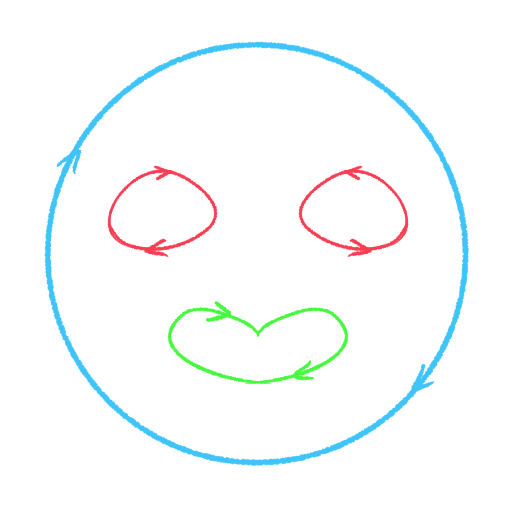

Te które natychmiast przychodzą do głowy to:

  - pętla od konturu twarzy
  - pętla od oczu
  - pętla od ust

!!! tip "Część 1 - ułożenie pętli"
	Dodaj na scenę kostkę i nałóż na nią modyfikator Mirror (pamiętaj o zaznaczeniu opcji "Clipping")

	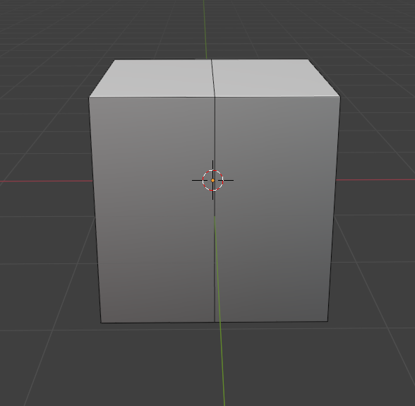

	Dodaj pętle tworzące ogólny obszar obu oczu
	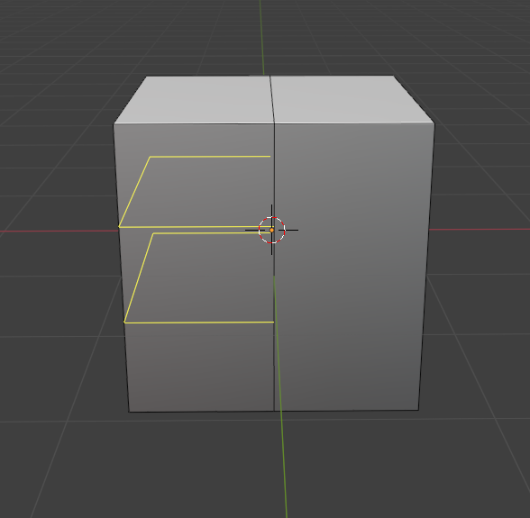
	
	Dodaj pętlę separującą oczy od ust
	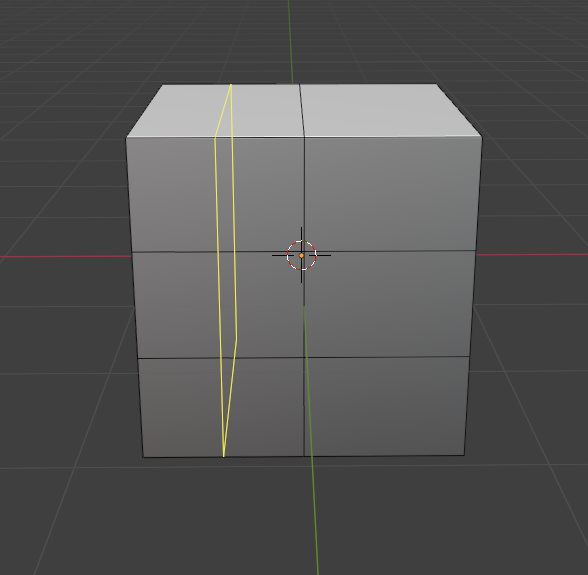

	Dodaj pętle od oczu i ust.
	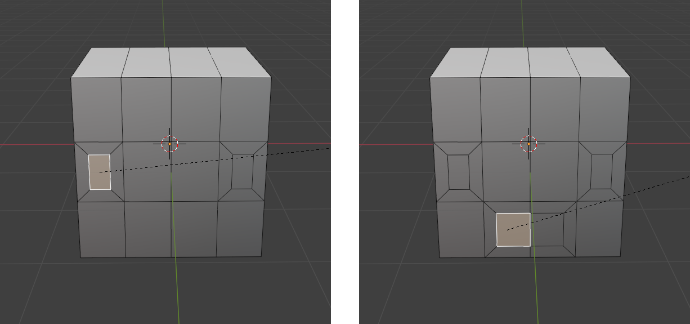

	Sculpt mode potrzebuje geometrii do deformacji. Wyrównaj gęstość geometrii z boku modelu.
	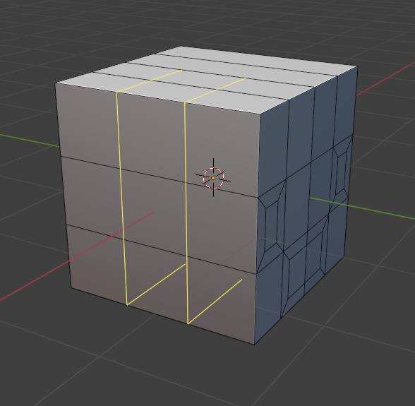
	
	Usuń ściany odpowiadające za wnętrze oczu i ust dla poprawienia widoczności
	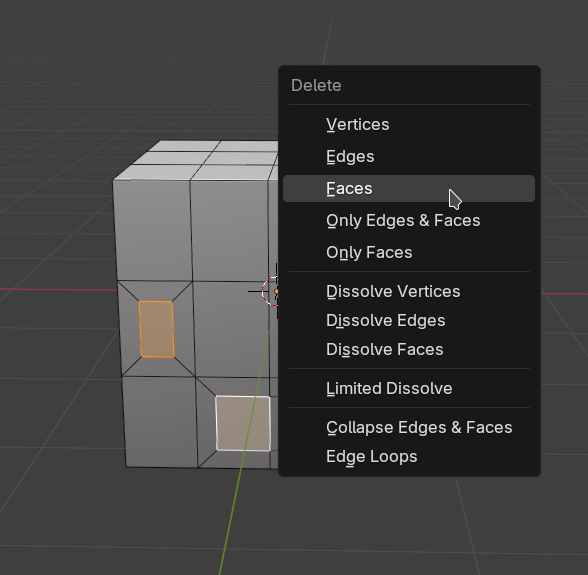

Gdy mamy już ułożone pętle możemy teraz deformować nasz mesh w prosty sposób.

!!! tip "Część 2 - deformacje"
	<video controls>
		<source src="../../assets/vid/organic-modeling/face/basic-face-deform.webm" type="video/mp4">
	</video>

## Przykład 2 - więcej pętli
Nasza twarz posiada za mało geometrii, przez co nasze deformacje w ramach Sculpt Mode są ograniczone. Gdzie jednak mamy kłaść dodatkowe pętle? Skąd je brać?

!!! tip "Analiza referencji"
	Analiza referencji jest **kluczowa** w modelowaniu organicznym. Nawet jeżeli pamiętamy na oko jak wygląda bazowo model to często nie pamiętamy jak wygląda w trakcie. Niech jako przykład posłuży twarz człowieka.
	
	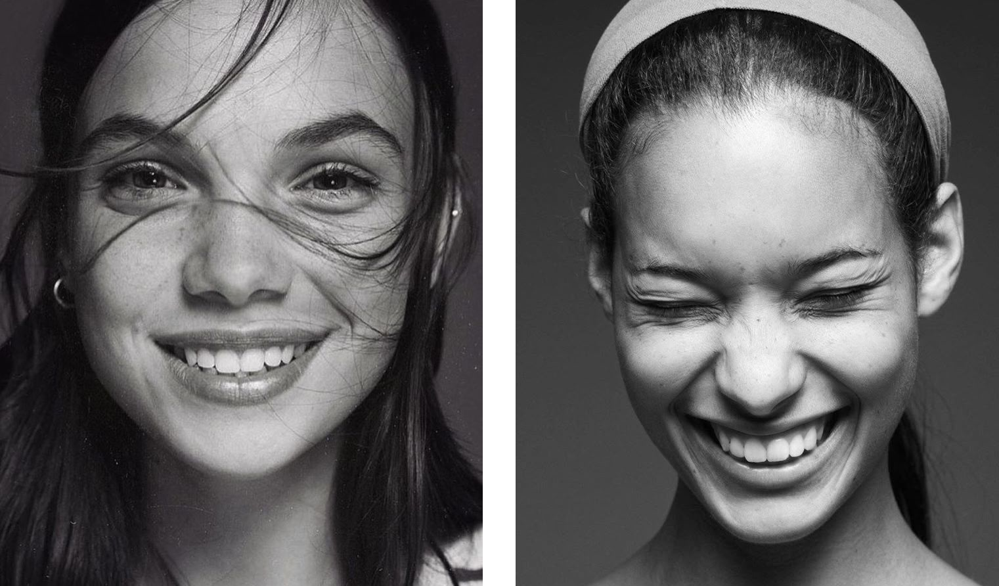

	Zapamiętaliśmy oczy i usta. Bardziej oczywiste jest to, o odstającym nosie. Mniej oczywiste jest jednak to, że zapomnieliśmy postawić pętlę od nosa i policzków, idącą wzdłuż ruchu mięśni twarzy. Robi się ona w pełni widoczna dopiero w trakcie uśmiechu (pomarańczowa pętla)

	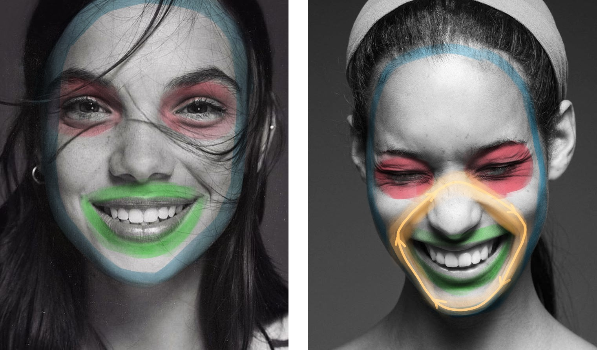
	
	Należy ponadto pamiętać o proporcjach:

	- wysokość ok. 2x większa od szerokości
    - oczy i nos dzielą twarz na równe trzy części
	- wysokość twarzy pod brwiami równa wysokości dwóch nosów
	- itd...
	
	Po więcej informacji dotyczących proporcji i rozmieszczenia form twarzy warto zajrzeć do zewnętrznych źródeł (np. książki o anatomii dla artystów)

!!! tip "Część 1 - ułożenie pętli"
	Dodaj na scenę kostkę i nałóż na nią modyfikator Mirror (pamiętaj o zaznaczeniu opcji "Clipping"). Zmień jej rozmiar tak, aby pasował do ogólnych proporcji twarzy.

	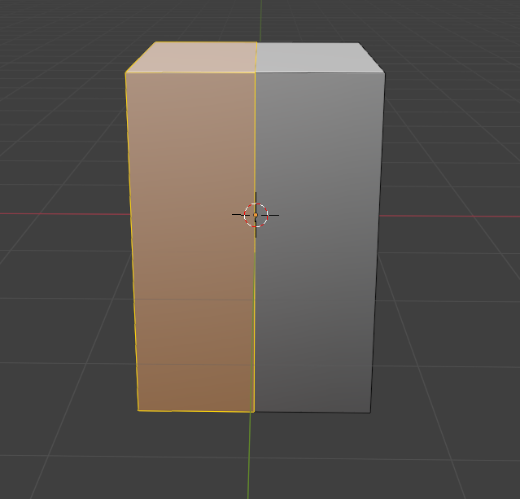
	
	Dodaj pętle oddzielające obszar oczu od reszty
		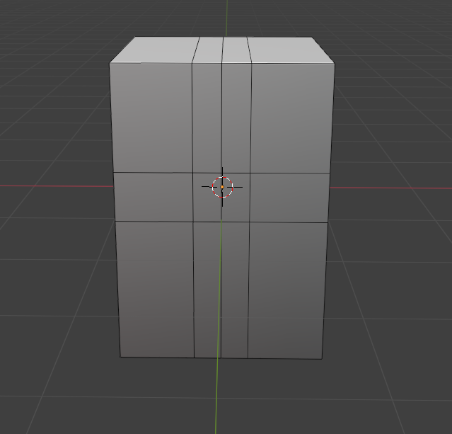

	Zaznacz obszar nosa za pomocą extrude	
		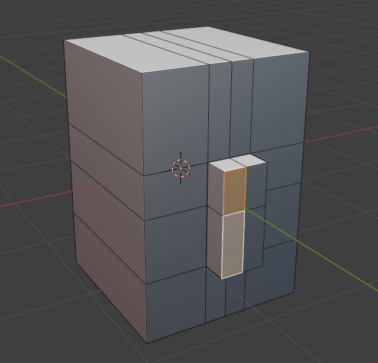
	
	Dodaj pętle oczu, mięśni twarzy i ust
		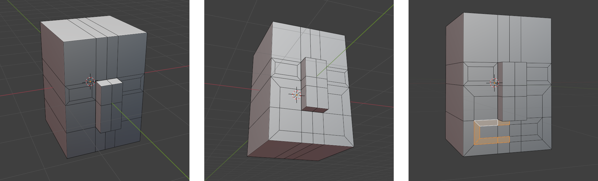

	Wyrównaj gęstość geometrii
		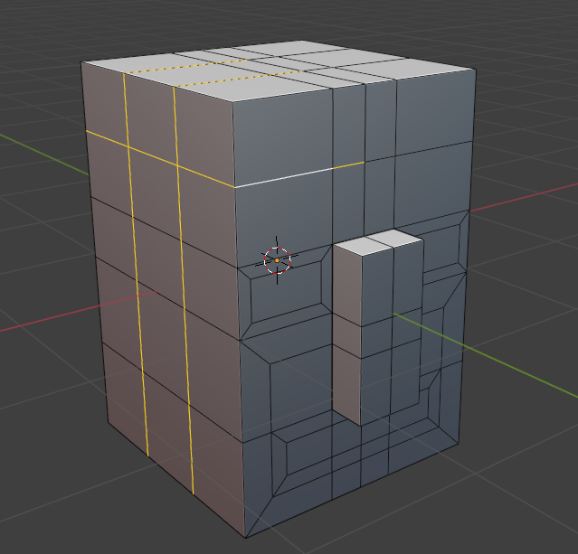
		
	Usuń ściany odpowiadające za wnętrze oczu i ust dla lepszej widoczności.
		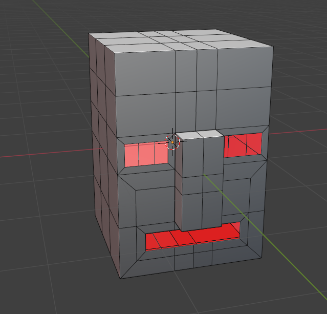

!!! tip "Część 2 - deformacje"
	<video controls>
		<source src="../../assets/vid/organic-modeling/face/face-deform.webm" type="video/mp4">
	</video>

	Uwaga - filmik został przyspieszony 2,5 krotnie. Nie bój się spędzać dużej ilości czasu na tym etapie - to normalne.

## Wnioski z przykładów
...ale po co to było? Co mam z tego wynieść?

!!! note "Czy mam tak zawsze modelować?"
	**NIE!** To był tylko pokaz jednej z dostępnej technik modelowania (rozdzielenie kładzenia pętel z definicji głównych form modelu).

!!! note "Czy korzystając z tej techniki zawsze muszę rozdzielać Edit Mode i Sculpt Mode?"
	**NIE!** Przechodź między Sculpt Mode a Edit Mode tyle razy ile tego potrzebujesz.

!!! note "Topologia a formy"
	Główną rzecz jaką należy wynieść z tego przykładu to fakt, że dobra topologia pozwala nam na deformowanie modelu w taki sposób, aby uchwycić na nim pożądane przez nas formy.
	
	To jest - **nie należy się bać tego że nasz model obecnie źle wygląda** bo jest spora szansa że da się go poprawić samym deformowaniem wierzchołków!

## Ćwiczenia
!!! example "Zadanie 3"
	Przeanalizuj referencje i zamodeluj misia.
	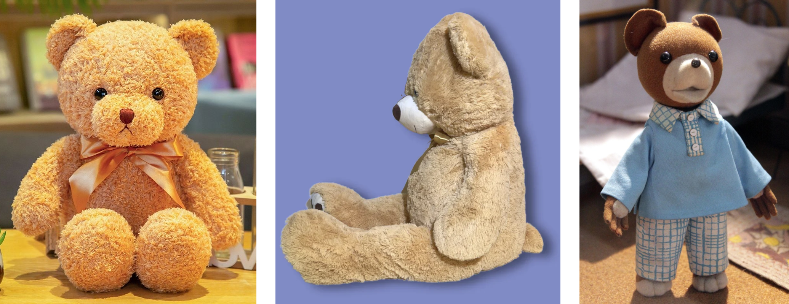

!!! example "Zadanie 4"
	Zdeformuj swojego misia tak, aby wyglądał kompletnie inaczej (np. jeżeli twój miś jest mały i ma krótkie kończyny to zamień go na dużego z długimi). Nie zmieniaj topologii w Edit Mode!
