# Subdivision modeling. Przekierowywanie pętli.

## Wstęp

Nasze poprzednie modele opierały się o stylistykę low-poly. Stanowi ona spore ograniczenie dla artysty, w końcu do zamodelowania organicznych form potrzebujemy więcej detalu. Z pomocą przychodzi technika powierzchni podziałowych - subdivision surfaces. Będą to też pierwsze zajęcia w których dogłębnie przejdziemy przez główne zasady topologii.

## Modyfikator Subdivision Surface
Nasze zajęcia rozpoczniemy od badania modyfikatora Subdivision Surface. Nazywany jest on również często subsurf, sub-d, smooth lub po prostu subdivision.

!!! example "Zadanie 1"
	Dodaj z menu Add kostkę. Następnie nałóż na nią modyfikator Subdivision Surface. Zobacz jak się on zachowuje gdy dodasz do niego geometrię (np. za pomocą loop cut i extrude).

	<video controls>
		<source src="../../assets/vid/subdivision-modeling/subsurf-modifier/subsurf.webm" type="video/mp4">
	</video>

### Podział powierzchni
!!! info "Powierzchnie podziałowe - Pixar w pudełku"
	<iframe width="100%" style="aspect-ratio: 16 / 9" src="https://www.youtube.com/embed/2tMcSwc9gGg?si=sQiYY5e0qnkbnXzr?start=0&end=147" title="YouTube video player" frameborder="0" allow="accelerometer; autoplay; clipboard-write; encrypted-media; gyroscope; picture-in-picture; web-share" referrerpolicy="strict-origin-when-cross-origin" allowfullscreen></iframe>

Subdivision Surface iteracyjnie dzieli i wygładza powierzchnię naszego obiektu. Pozwala dzięki temu na uzyskanie gładkich, okrągłych form. Dokładniej - za pomocą algorytmu Catmulla-Clarka tworzy nowe wierzchołki na bazie średniej ważonej z pozycji środków ścian i krawędzi.

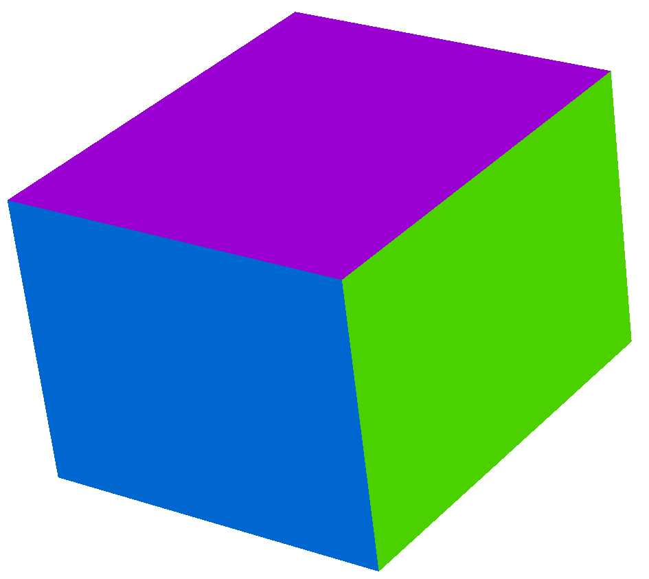

!!! note "Powierzchnia graniczna"
	Subdivision można powtarzać w nieskończoność. Proces ten zbiega się do pewnej powierzchni, tzw. *powierzchni granicznej* (ang. *limit surface*)

	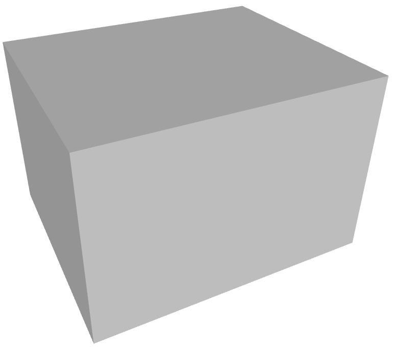

!!! note "Control cage"
	Oryginalna siatka daje nam punkty kontrolne, którymi możemy modyfikować gładszy obiekt. Nazywana jest ona *siatką kontrolną* (ang. *control cage*)

### Główne opcje modyfikatora
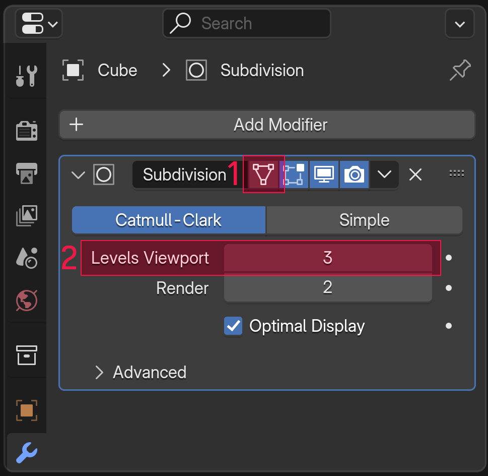

Na dzisiejszych zajęciach będziemy korzystać z dwóch opcji:

1. On Cage - rzutuje control cage na nasz wynikowy mesh. Wygładza dzięki temu sam widok wireframe.
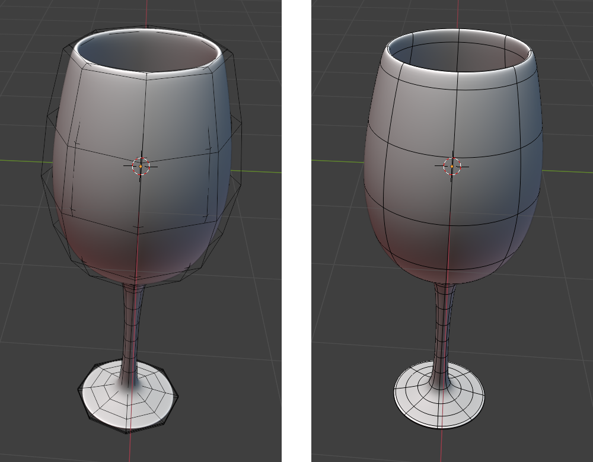
2. Levels Viewport - zwiększa poziom subdisivion (t.j. ilość iteracji dzielenia) w viewporcie.

!!! warning "Zużycie zasobów"
	Każdy kolejny poziom podziału zwiększa ilość ścian około czterokrotnie. Zwiększa to zarówno zużycie RAMu jak i czasu renderowania obiektów. Nie należy zwiększać zbędnie ilości geometrii jeżeli przestajemy wydzieć różnice w kolejnych poziomach subdivision.
	
!!! tip "Poziomy detalu"
	Ten sam obiekt może mieć niższy poziom podziału, jeżeli jest oddalony od kamery bądź słabo widoczny. Obiekty blisko kamery powinny zaś mieć odpowiednio wysoki poziom podziału.
	
## Wyostrzanie krawędzi - holding edges
Domyślnie subdivision dodaje geometrię kosztem wygładzenia detalu. To co w naszym oryginalnym modelu jest ostre zostaje domyślnie w pełni zaokrąglone w ramach uśredniania.

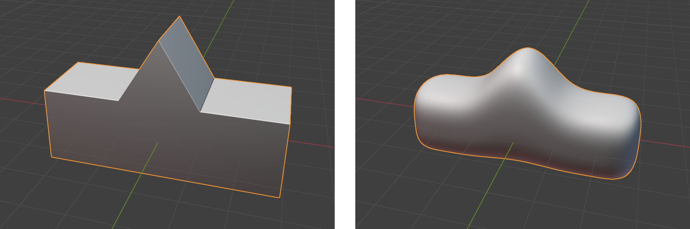

Ponieważ subdivision opiera się na uśrednianiu, możemy jednak skorzystać z tej samej techniki co w przypadku Smooth Shading, czyli dodać *holding edges* wokół krawędzi którą chcemy wyostrzyć. Dzięki temu wymusimy uśrednienie do ostrej wartości. Jest to jedna z podstawowych technik subdivision modeling.

!!! note "Holding edges w subdivision modeling"
	Potrzebne są razem trzy krawędzie koło siebie na control cage (originalna krawędź + holding edge po lewej i po prawej), aby wynikowy model posiadał w tym miejscu ostrą krawędź.

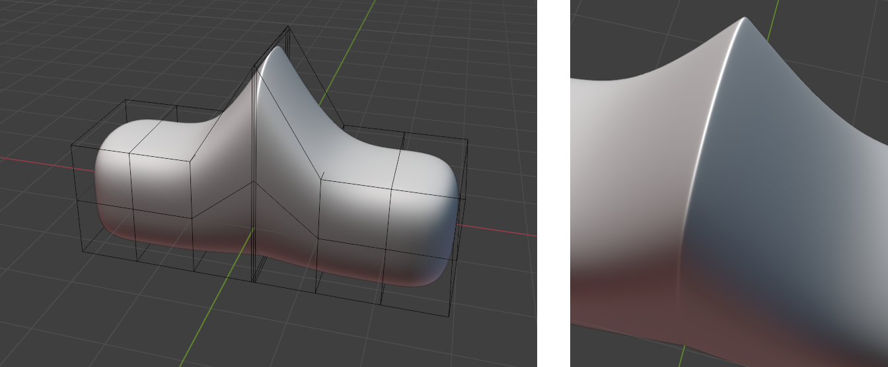

Interesujące modele posiadają kontrast na poziomie samych form. Istnieją w nich sekcje gładkie, jak i również kanciaste. Mieszając krawędzie wygładzane z tymi wyostrzanymi za pomocą holding edges możemy uzyskać ciekawe rezultaty.

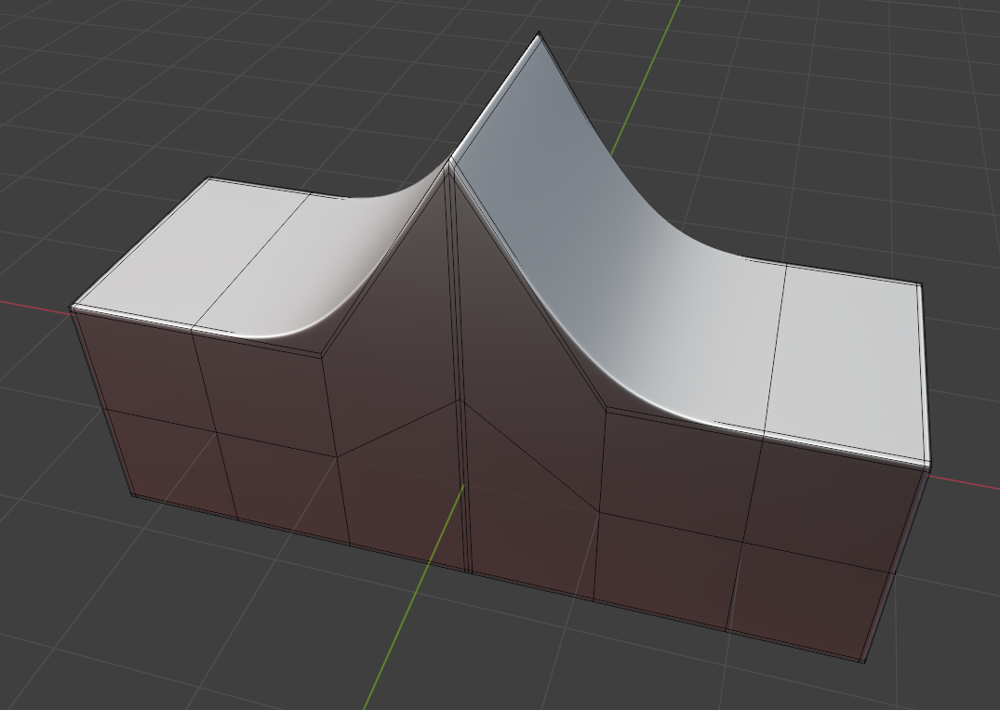

!!! tip "Subdivision + Smooth shading = ❤️"
	Ponieważ korzystamy z tej samej techniki, która naprawia cieniowanie w ramach Smooth Shading (holding edges), i ponieważ ilość geometrii w ramach subdivision jest ogólnie większa, możemy bez większych problemów łączyć subdivision ze smooth shading. Dzięki temu znacząco ograniczymy ilość poziomów podziałów wymaganych do uzyskania gładkich powierzchni.

!!! example "Zadanie 2"
	Dodaj ostre krawędzie do twojego poprzedniego modelu za pomocą techniki holding edges.

## Obiekty pod wpływem subdivision
Na razie mieliśmy styczność tylko z podziałem kostki. Sprawdźmy teraz jak subdivision wpływa na inne obiekty.

!!! example "Zadanie 3"
	Nakładaj po kolei subsurf na pozostałe obiekty z menu Add. W szczególności:

	- jak zachowują się one przy zwiększaniu poziomu podziału?
	- jak wyglądają pod różnymi kątami?
	- jak wyglądają po nałożeniu smooth shading?

Nakładając subdivision na kolejne obiekty obserwujemy dziwne rzeczy. O ile kostka i torus dzielą się dsf
dobrze, o tyle pozostałe obiekty trójwymiarowe dzielą się w sposób niespodziewany.

Przykładowo - UV Sphere wygląda na pierwszy rzut oka dobrze, lecz gdy spojrzymy się na nie z innej strony zobaczymy dziwne artefakty.

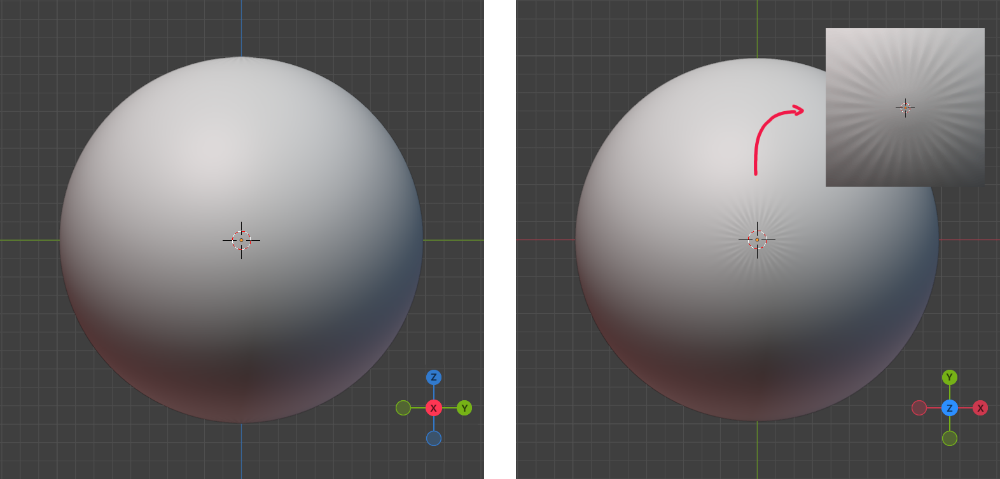

Innym przykładem jest Cylinder który po podziale kompletnie nie przypomina cylindra, zamiast niego przypomina balon z pręgami.

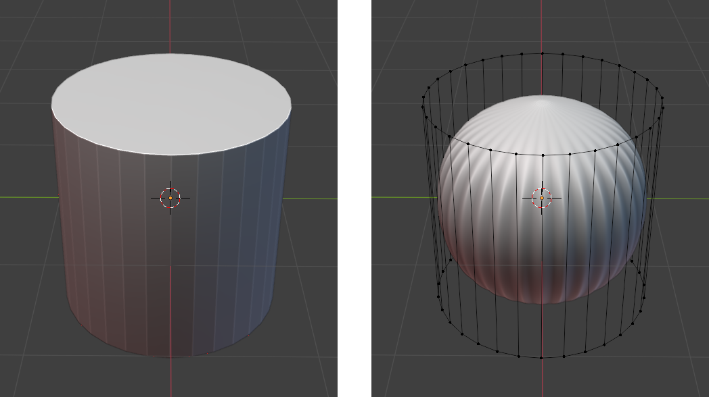

!!! question "Artefakty modelowania"
	Co jest powodem obserwowanych przez nas artefaktów?

## Subdivision pod spodem
Subdivision surface pod spodem bazuje na krzywach B-sklejanych (ang. B-spline).

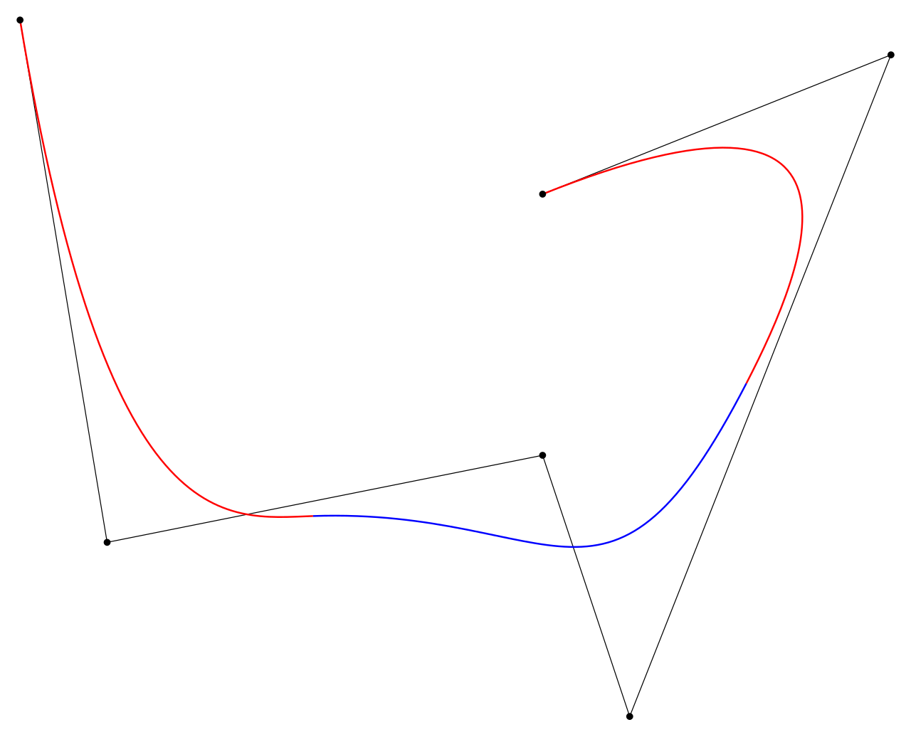

!!! tip "B-spline na żywo"
	Możesz zobaczyć jak działa B-spline na żywo korzystając z wizualizatora na [stronie Wolfram Alpha](https://demonstrations.wolfram.com/BSplineCurveWithKnots/).

To jest - wszystkie punkty naszego obiektu reinterpretuje jako punkty kontrolne krzywych B-sklejanych, a następnie dokonuje między nimi interpolacji do uzyskania gładkich powierzchni. Możemy zobaczyć wynikowe B-splajny bezpośrednio za pomocą opcji On Cage modyfikatora.

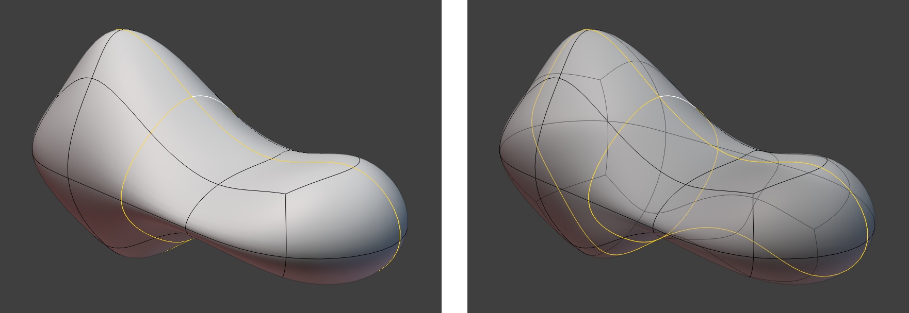

Istnieje jednak pewne założenie w ramach algorytmu Catmulla-Clarka: aby zachować wszystkie właściwości matematycznej ciągłości B-splajny muszą się domykać. Dzieje się tak dla wierzchołków, z których wychodzą dokładnie cztery krawędzie. Co się dzieje w innych przypadkach?

### Bieguny (edge poles)
Wierzchołki do których zbiega się inna liczba krawędzi niż cztery to tzw. bieguny (ang. *edge poles*) bądź punkty nadzwyczajne (ang. *extraordinary points*). Przerywają one pętle.

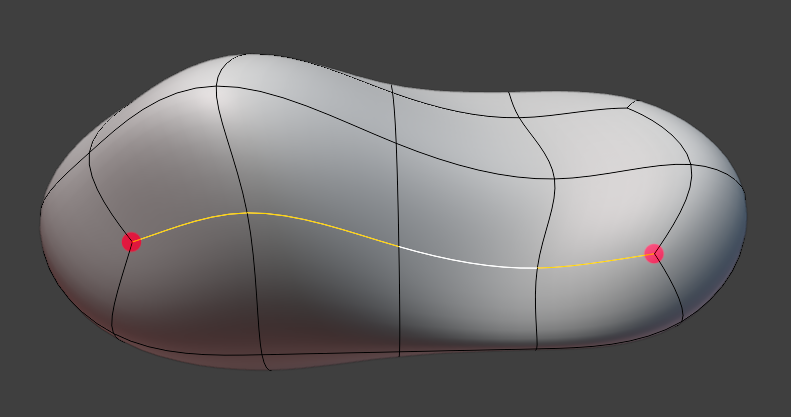

W tych punktach tracimy matematyczne właściwości ciągłości. Powoduje to różnego rodzaju artefakty widoczne zwłaszcza, gdy te punkty są umieszczone na wykrzywionych obszarach.

Można to zauważyć na przykład poddając kostkę operacji subdivision. Obserwując ją przez odpowiedni matcap możemy zauważyć, że tam gdzie zbiegają się trzy krawędzie ze sobą (to jest - tworzą biegun trzeciego stopnia) zachodzi załamanie światła (jest ono przyciągane do tego 3-pole).

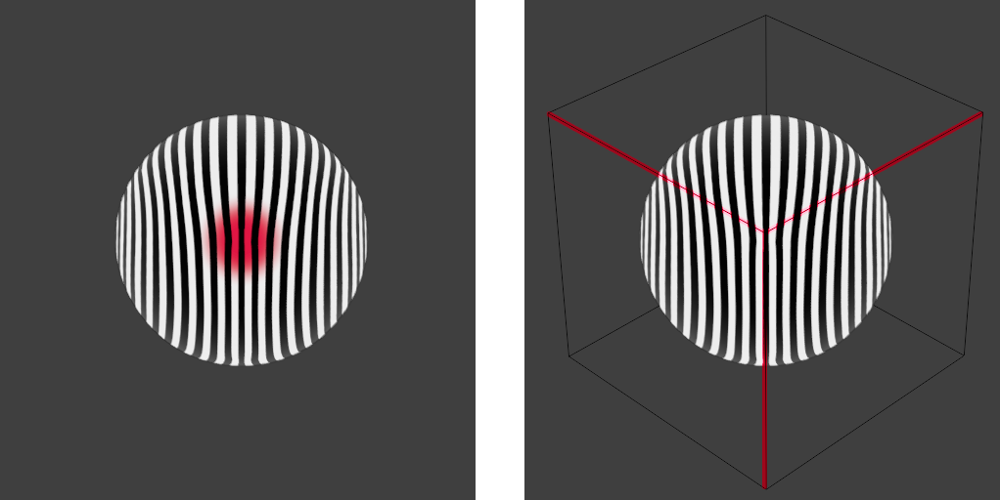

Im wyższy jest stopień bieguna tym artefakty stają się coraz bardziej widoczne. Patrząc się na model UV sphere widzimy natychmiast o co chodzi - domyślnie UV sphere tworzy się z 32 segmentami. Są one więc złączone po środku biegunem 32 stopnia!

### Konwersja N-gonów

!!! question "Brak dużych biegunów na cylindrze"
	Przykład z cylindrem nie posiadał żadnego widocznego dużego bieguna. Dlaczego jego geometria została jednak tak bardzo zniszczona po nałożeniu subdivide?

Dzieje się tak dlatego, że cylinder posiada dwa duże n-gony (jego podstawy). Subdivision dzieląc ścianę dzieli każdą jej krawędź na pół a następnie łączy wynikowe wierzchołki po środku tej ściany.

Możemy zobaczyć dokładnie o co chodzi poprzez nałożenie Subdivision Surface w trybie Simple (czyli podział obiektu bez wygładzania/zaokrąglania krawędzi):

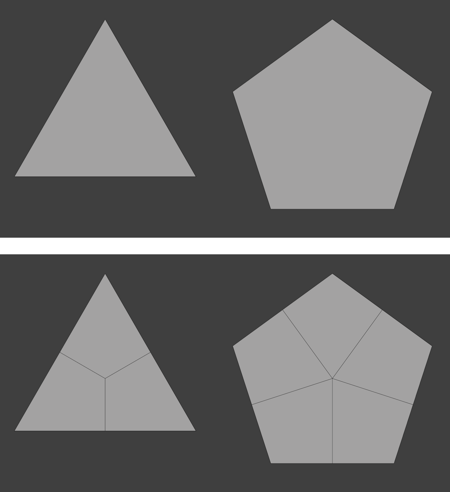

Zauważ, że:

- w wyniku tego podziału każdy n-gon staje się zamieniony na quad
- po środku ściany tworzy się biegun o stopniu równym ilości jej krawędzi

!!! note "Subdivision Surface konwertuje wszystko na quady"
	Algorytm Catmulla-Clarka jest w stanie skonwertować każdy model na quady. Robi to kosztem wprowadzania nowych biegunów.
	
Wracając do naszego poprzedniego przykładu - domyślnie cylinder tworzony jest z 32-krawędziowymi podstawami. Po pierwszej iteracji subdivision konwertowane one są na dwa bieguny 32 stopnia.

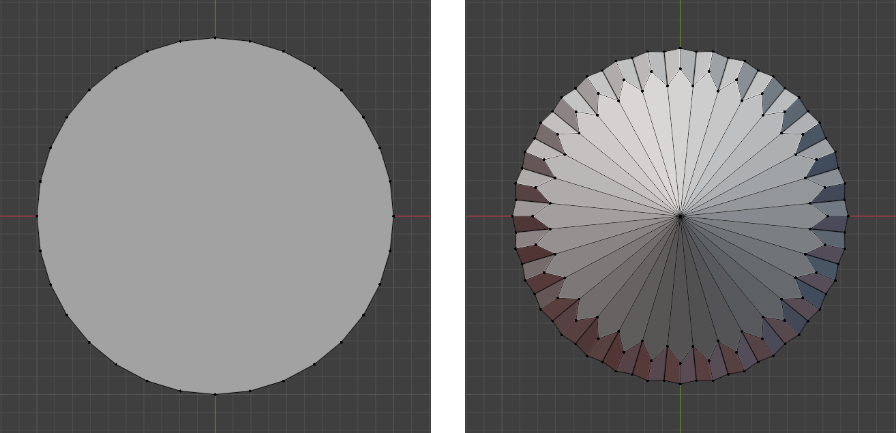

Tym razem wynikowe quady są dodatkowo mocno rozciągnięte i ściśnięte, w końcu subdivision musiało zrobić połączenie od środka podstawy do cienkich krawędzi bocznych. Powoduje to dodatkowe artefakty w przypadku kolejnych poziomów podziału - im bliżej krawędzie są koło siebie, tym stają się ostrzejrze w dalszych iteracjach.

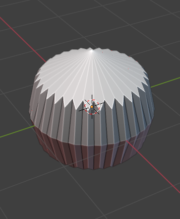

## Ręczna modyfikacja topologii
Do kolejnych zadań potrzebujemy nowych narzędzi pozwalających na ręczne dodawanie wierzchołków i krawędzi w dowolnych miejscach.

### Merge
- Skrót: `M`

Merge łączy ze sobą dwa wybrane wierzchołki tworząc w ich miejscu biegun.

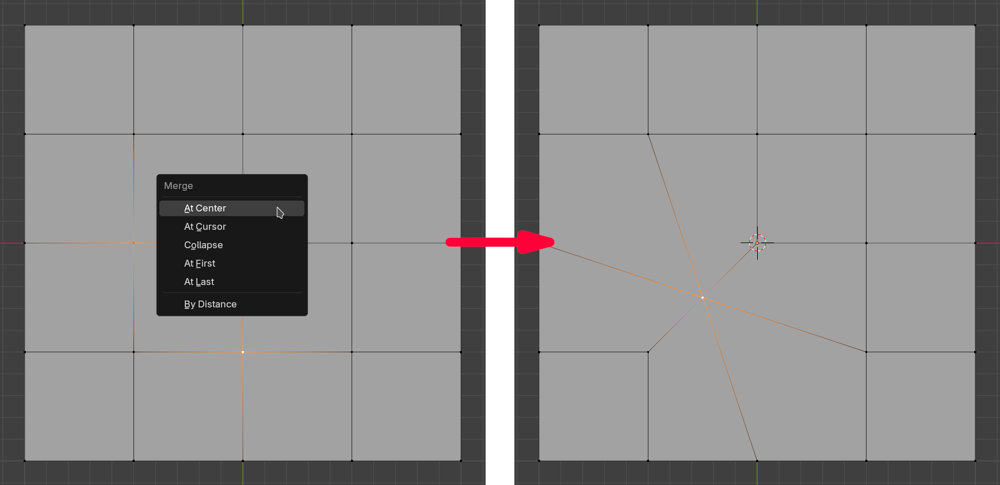

### Knife
- Skrót: `K`

Knife pozwala na wycinanie nowej topologii w meshu.

<video controls>
	<source src="../../assets/vid/subdivision-modeling/tools/knife.webm" type="video/mp4">
</video>

### Dissolve
- Skrót: `X`

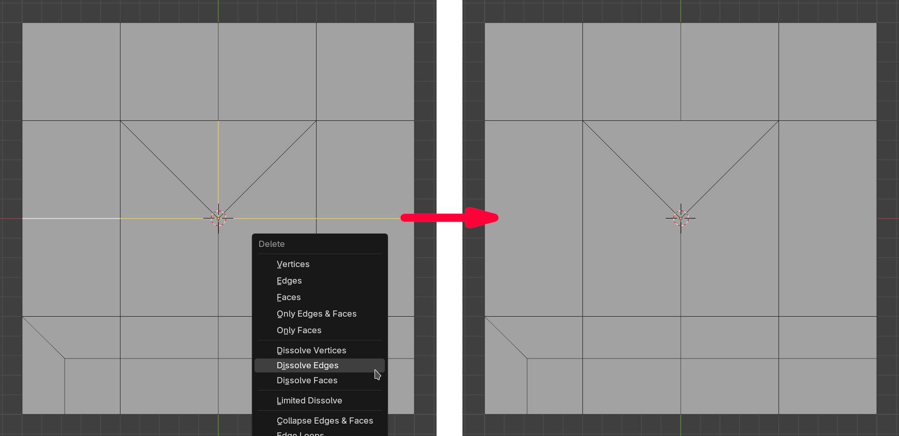

Dissolve pozwala na usunięcie niepotrzebnej topologii pozostawiając przy tym resztę.

## Subdivision zniszczonej topologii
Możemy ręcznie popsuć topologię dobrego modelu aby zobaczyć na żywo jak bieguny i n-gony wpływają na podział powierzchni.

!!! example "Zadanie 4"
	Utwórz poniższy mesh. Nałóż na niego subdivision i włącz matcap pozwalający na dobry podgląd odbić i cieniowania.
	
	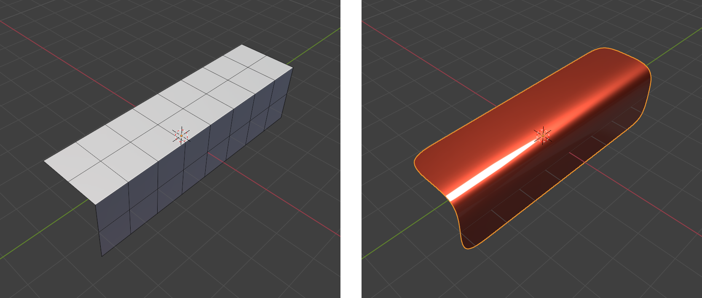
	
	Zniszcz jego topologię za pomocą poznanych wcześniej narzędzi. Zobacz jak dodawanie nowych biegunów i n-gonów wpływa na cieniowanie i na geometrię modelu.

	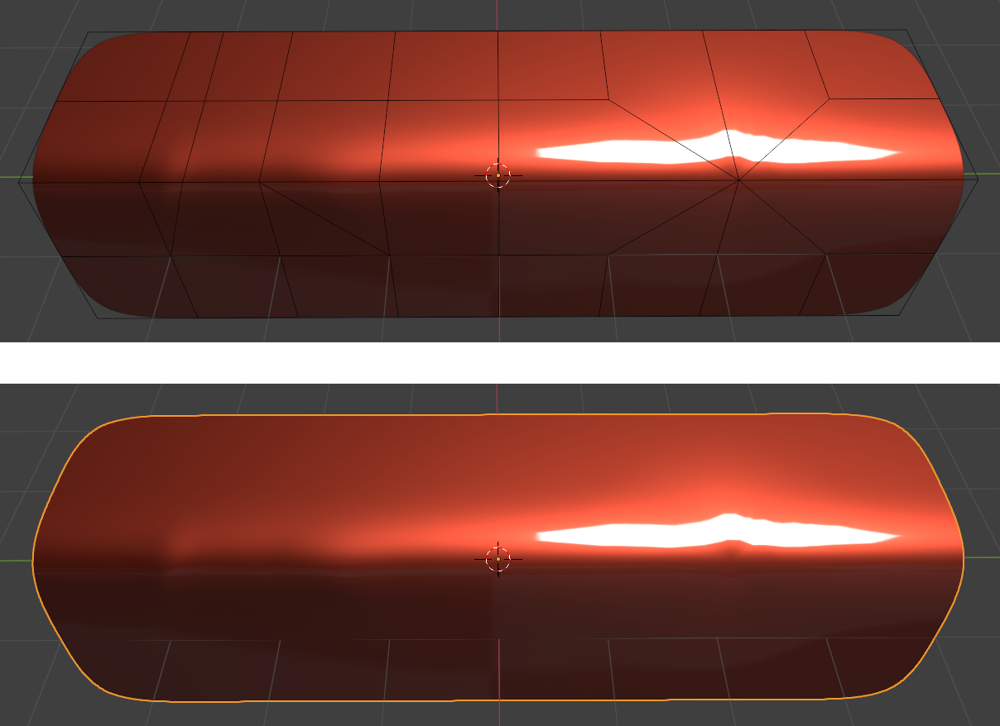
	
Powyższy przykład ilustruje poważny problem z artefaktami w subdivision modeling - dotyczą one nie tylko cieniowania, ale również samej geometrii. Widzimy to przesuwając wynikowy mesh tak, aby zobaczyć jego zakrzywienie.

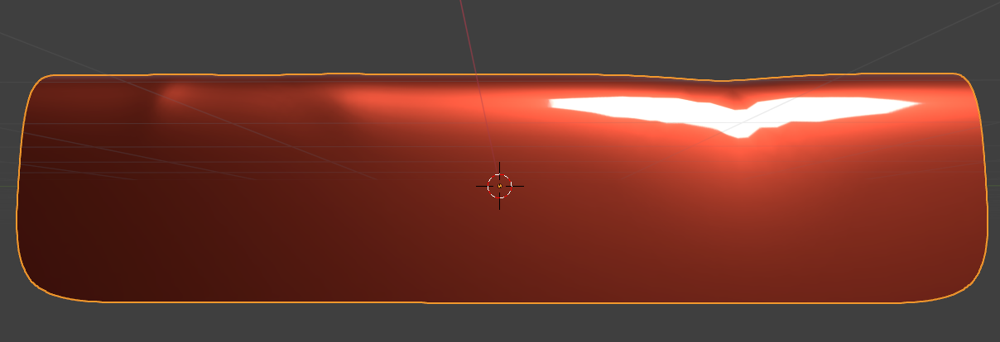

!!! note "Artefakty subdivision surface"
	Artefakty subdivision surface dotyczą nie tylko cieniowania - powodują również wykrzywienie samej geometrii.

## Prymitywy subdivision modeling
Łatwo zauważyć, że prymitywy oferowane przez menu Add nie są dostosowane pod subdivision modeling. Skoro wiemy skąd biorą się artefakty to jak możemy wykonać nowe prymitywy, które nie będą ich posiadać?

### Cylinder
Zacznijmy nasze rozważania od cylindra, bo jest go najłatwiej naprawić.

Ponieważ mesh będzie później dzielony nie potrzebujemy aż tylu krawędzi. Stwórzmy nowy cylinder z podstawami o 16 bokach. Wiemy już, że poprzedni artefakt został spowodowany obecnością n-gona. Usuńmy go więc tak jak robiliśmy poprzednio za pomocą narzędzia grid fill.

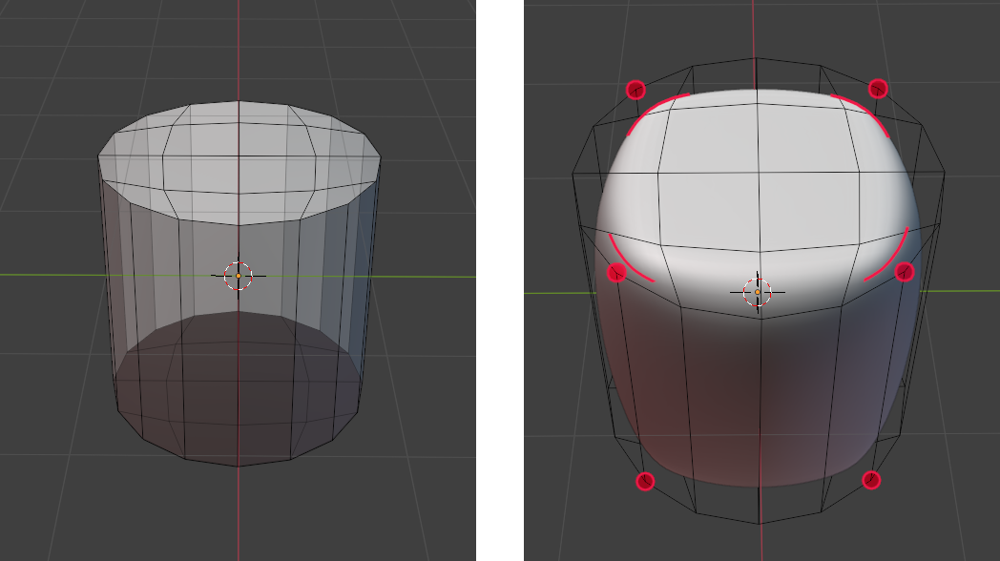

Możemy zauważyć natychmiastową poprawę podziału. Nadal nie jest on jednak idealny - podział się zakrzywia koło biegunów (bieguny i zła krzywizna zaznaczone na czerwono).

O ile nie jesteśmy w stanie się ich pozbyć to możemy je przenieść do środka za pomocą narzędzia inset. Doda to nam od razu pętle w których możemy umieścić holding edges za pomocą narzędzia loop cut.

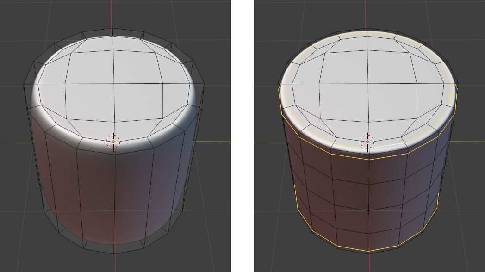

Nasz model nie posiada już żadnych widocznych artefaktów. Możemy więc zakończyć pracę.

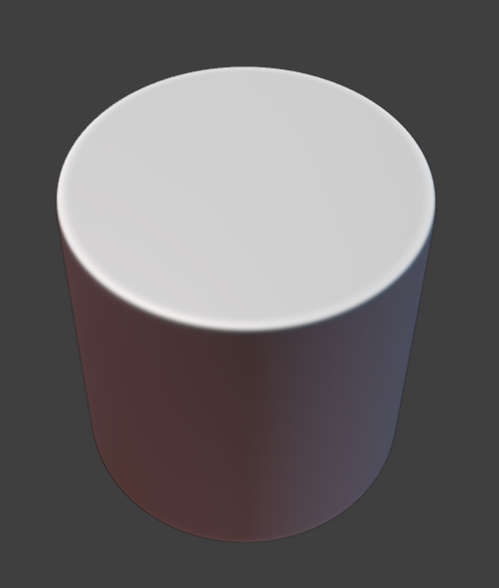

!!! tip "Inset a grid fill"
	Zauważ, że inset ścisnął zewnętrzne ściany grid fill (spójrz jak wyglądały ściany zawierające czerwone wierzchołki przed i po inset). By tego uniknąć najlepiej jest najpierw wykonać inset a dopiero potem zamienić n-gon na quady za pomocą grid fill. W tym poradniku zrobiliśmy na odwród, aby pokazać jak można metodycznie naprawić geometrię.

### Quad Sphere

Nie jesteśmy w stanie naprawić w łatwy sposób UV Sphere. Szybciej jest wykonać od nowa nowy prymityw - tzw. Quad Sphere. Zauważ, że kostka z wieloma poziomami podziału staje się coraz bardziej okrągła. Gdybyśmy tylko wyrównali wynikową geometrię uzyskalibyśmy idealną sferę.

Dodaj na scenę kostkę i nałóż na nią subdivision. Na poniższym przykładzie wykonane zostały 3 podziały. Nie będziemy dzielić teraz tej kostki bardziej, bo będą wykonywane później kolejne podziały.

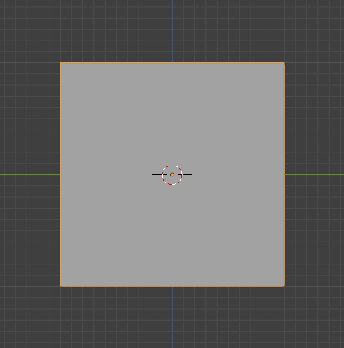

Zatwierdź subdivision najeżdżając myszką na modyfikator i klikając `Ctrl` + `A`, bądź wybierając `Apply` z menu ukrytego pod strzałką.

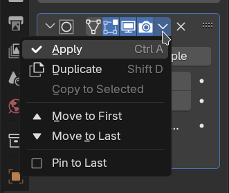

Mesh który uzyskaliśmy jest okrągły, lecz nie podąża za dokładnym kształtem sfery. Po zaznaczeniu całego obiektu w edit mode możemy go zamienić na sferę za pomocą operacji To Sphere (skrót `Shift` + `Alt` + `S` bądź wewnątrz menu Mesh - Transform). Uzyskamy wtedy topologię, na którą będziemy mogli nałożyć subdivision bez większych artefaktów.

<video controls>
	<source src="../../assets/vid/subdivision-modeling/quad-sphere.webm" type="video/mp4">
</video>

## Ćwiczenie - modelowanie kieliszka
!!! example "Zadanie 5"
	Zamodeluj kieliszek na podstawie podanej referencji. Zwróć uwagę na to gdzie będą potrzebne holding edges. Na kieliszku nie mogą być widoczne artefakty cieniowania.

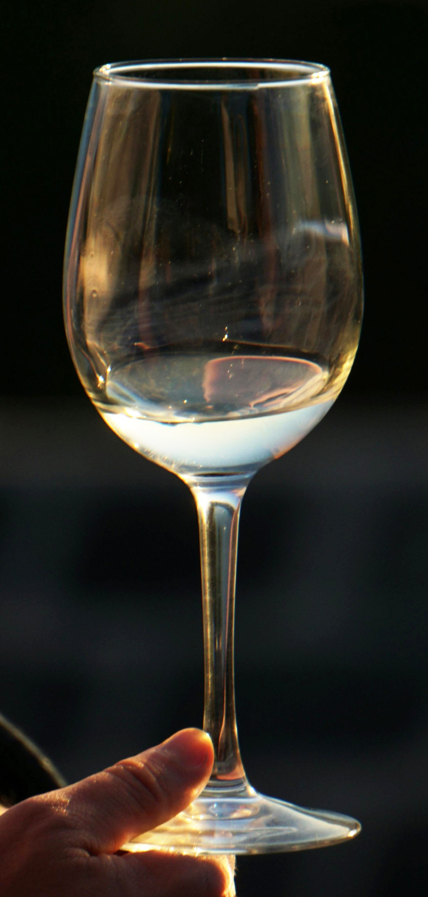

??? tip "Podpowiedź 1 - wybór prymitywu"
	Rozpocznij modelowanie kieliszka od dodania cylindra.
	
??? tip "Podpowiedź 2 - Modelowanie krok po kroku"
	Dodaj na scenę nowy cylinder o ośmiu bokach.

	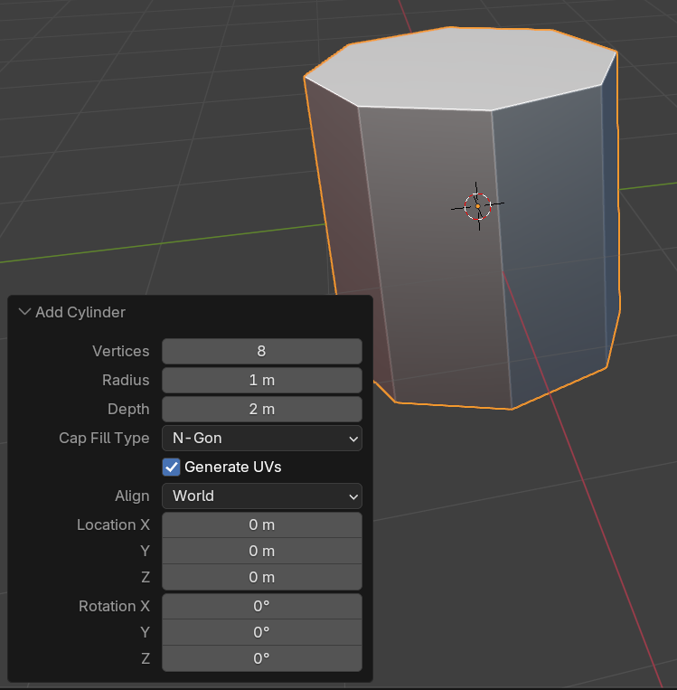
	
	Napraw jego topologię. Pamiętaj o zrobieniu tego na obu podstawach!

	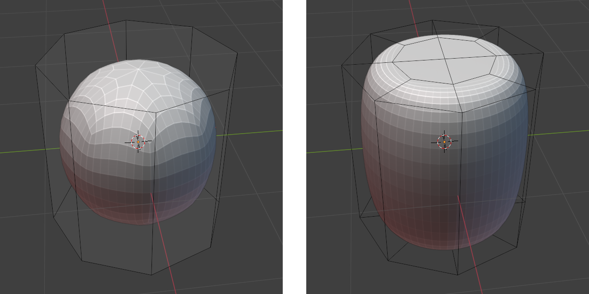
	
	Wyrównaj gęstość geometrii na ścianach bocznych. Następnie wytłocz rączkę i podstawkę kieliszka.

	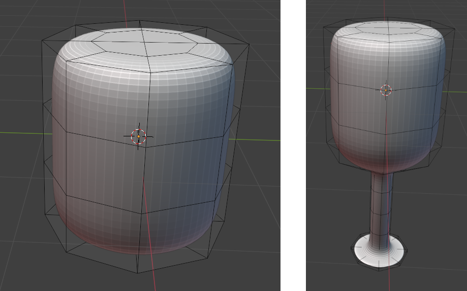
	
	Wytłocz wnętrze kieliszka. Pamiętaj o wyrównaniu w nim gęstości geometrii.

	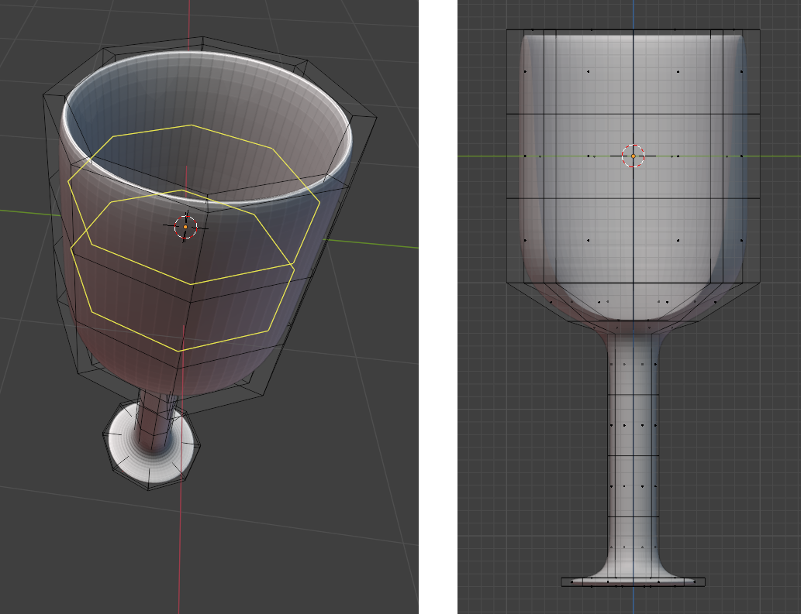
	
	Włącz smooth shading jeżeli jeszcze nie zostało to zrobione.

	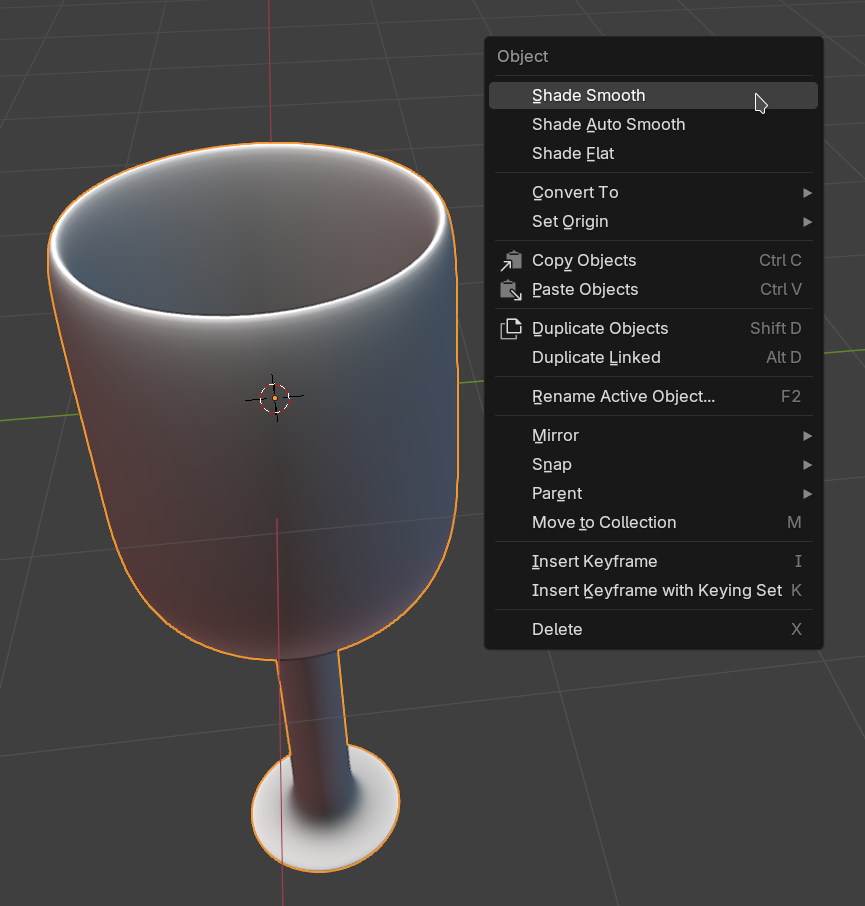
	
	Na referencji rączka jest zakrzywiona. Potrzebne są na niej pętle, które później będzie można wygiąć.

	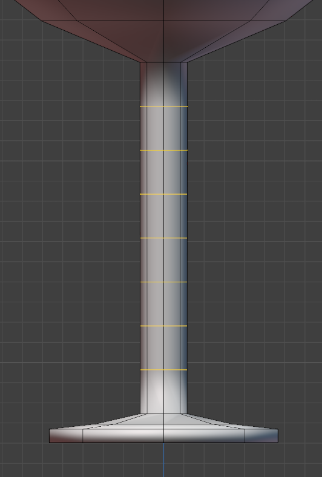
	
	Na referencji połączenie między kieliszkiem a rączką jest zakrzywione. Zamodeluj to za pomocą bevel.

	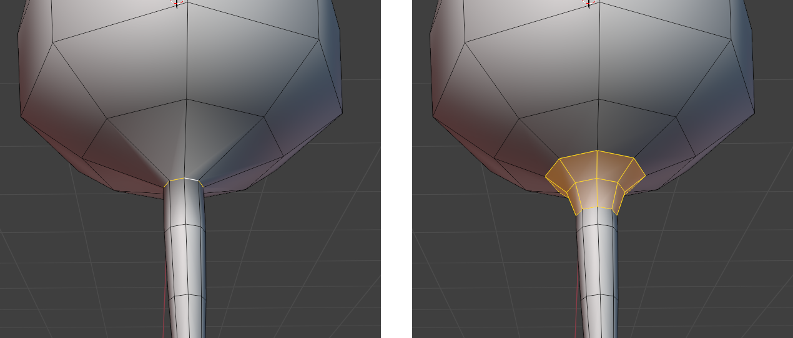
	
	Dodaj zakrzywienie rączki za pomocą proportional editing.

	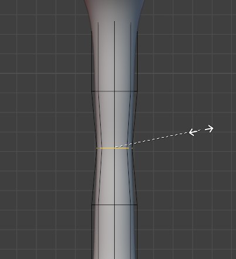
	
	Dodaj zakrzywienie góry kieliszka za pomocą proportional editing. W tym momencie skończyliśmy modelować główne formy - możesz więc już dodać holding edges.

	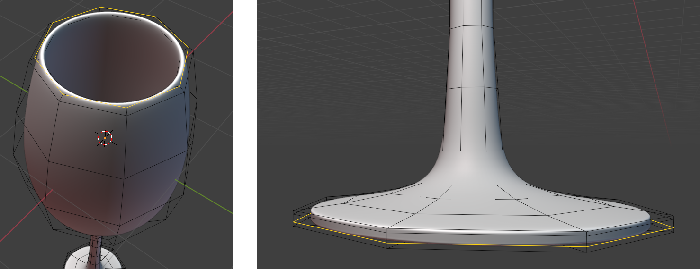
	
	Nasz kubek jest już gotowy

	
	
## Modelowanie aparatu

Modelowanie poprzedniego obiektu poszło gładko. Spróbujmy w ramach ćwiczeń zamodelować inny obiekt złożony również z prostych prymitywów.

!!! danger "Zadanie 6"
	Zamodeluj aparat na podstawie podanej referencji. Aparat musi być z nią zgodny (t.j. musi posiadać okrągły obiektyw z kwadratowym otworem oraz ostre krawędzie). Model nie może posiadać artefaktów cieniowania.
	
	**Nie będziesz w stanie wykonać poprawnie tego zadania. Wobec tego nie skupiaj się na detalach tylko modeluj główne formy, najlepiej rozpoczynając od obiektywu.**

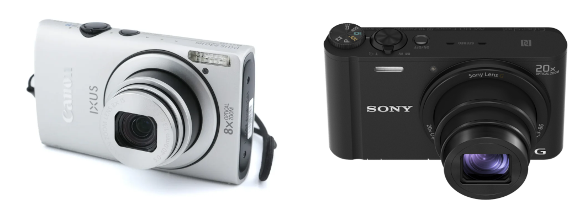

!!! note "Podział na obiekty"
	Nie posiadamy jeszcze narzędzi do zamodelowania aparatu jako jeden obiekt. Obiektyw jest częścią, którą można odłączyć od aparatu. Wobec tego najlepiej jest zamodelować aparat jako dwa osobne obiekty (ciało i obiektyw).
	
??? danger "Próba modelowania"
	Modelowanie rozpoczniemy od obiektywu. Składa się on z wielu warstw cylindrów (trochę jak tort).
	
	Dodaj na scenę cylinder. Stanowił on będzie najniższą warstwę obiektywu, z której będziemy wytłaczać resztę. Niech cylinder posiada 16 krawędzi aby po przyszłym grid fill mieć miejsce na wytłoczenie kwadratowej dziury. Nie naprawiaj jeszcze topologii - ułatwi nam to późniejsze wytłaczanie warstw.

	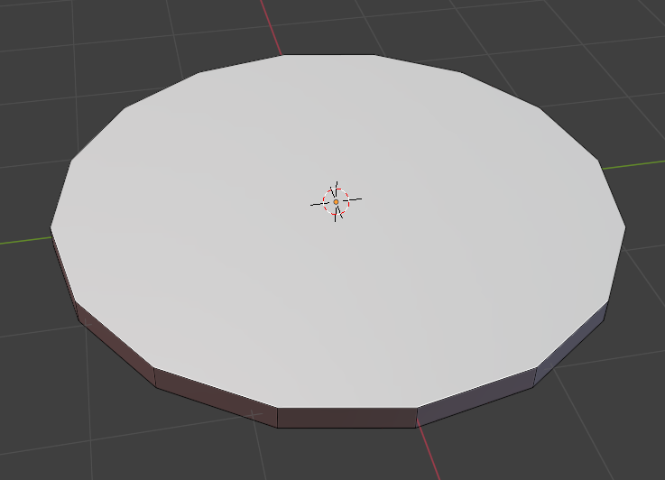
	
	Wytłaczaj po kolei kolejne warstwy obiektywu za pomocą inset i extrude.

	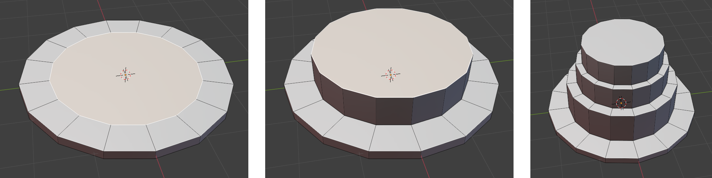
	
	Napraw topologię. Pamiętaj o uwzględnieniu obu podstaw.

	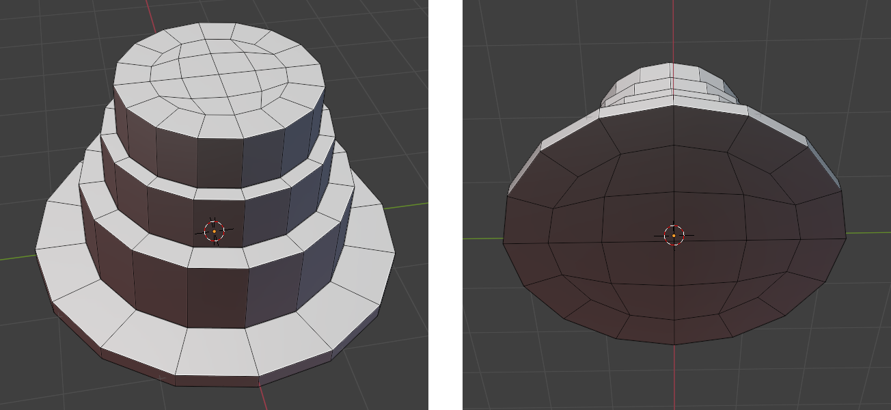
	
	Przejdźmy do wytłaczania dziury w obiektywie. Możemy spłaszczyć krawędzie wygenerowane przez grid fill za pomocą narzędzia skalowania (`S` + wybrana oś + `0`). Jeżeli zrobimy to od razu wpłyniemy jednak na krzywiznę pętli poligonów dookoła grid fill (porównaj jak wygląda obiekt po przeskalowaniu krawędzi - czerwone linie wskazują poprzednią, oryginalną krzywiznę). **Nie rób tego w ten sposób**

	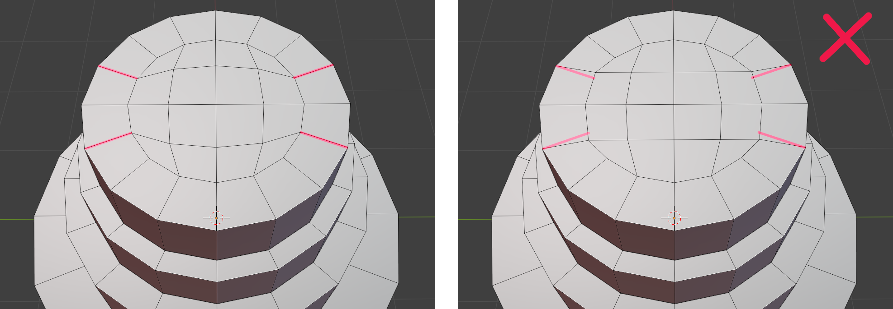
	
	Wobec tego przed spłaszczeniem krawędzi dodamy dodatkową pętlę (zaznaczona na niebiesko) która będzie chroniła krzywiznę przed zmianą. Po przygotowaniu kwadratowej dziury wytłocz ją wgłąb modelu.

	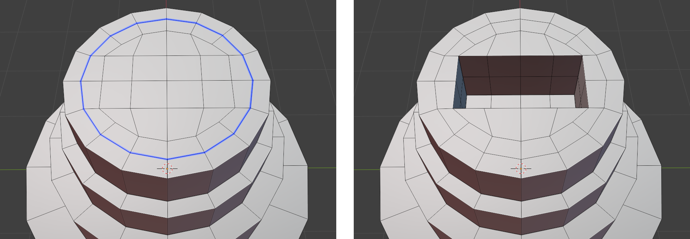
	
	Nałóż na model subdivision surface i włącz smooth shading.

	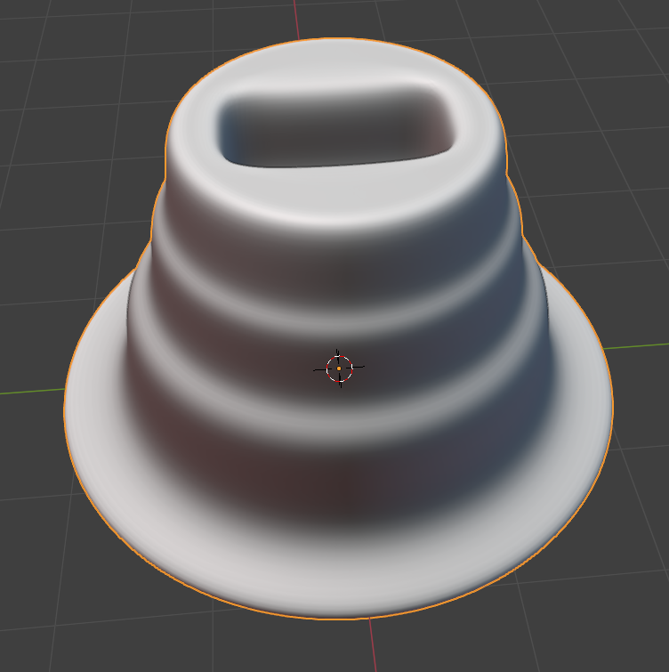
	
	Subdivision wygładziło wszystkie krawędzie. Wobec tego dodajmy holding edges dla poszczególnych warstw obiektywu.

	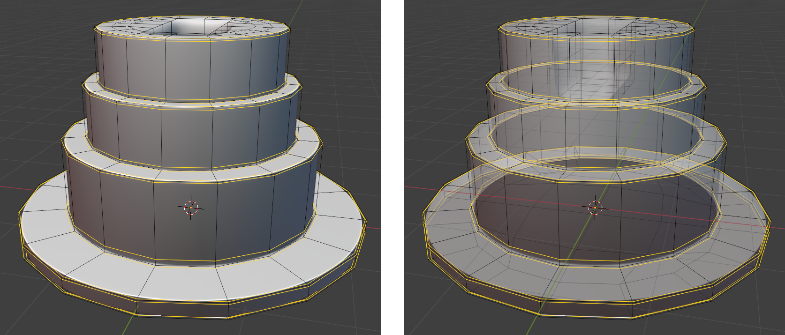
	
	Dodaj holding edges dla kwadratowego otworu. 

	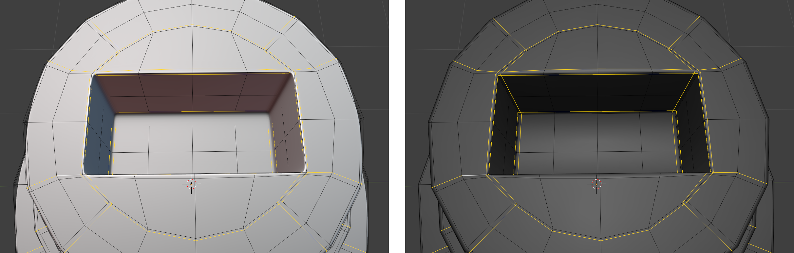
	
	**...coś jest nie tak - zakrzywienie całego naszego modelu się popsuło!**

	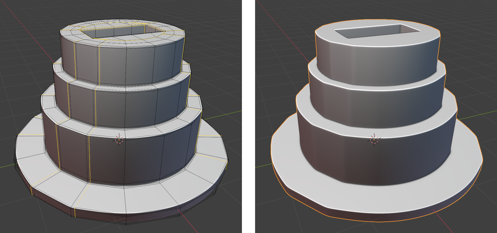
	
	Na widoku z góry model wygląda jeszcze gorzej. Na czerwono zaznaczona została oczekiwana krzywizna.

	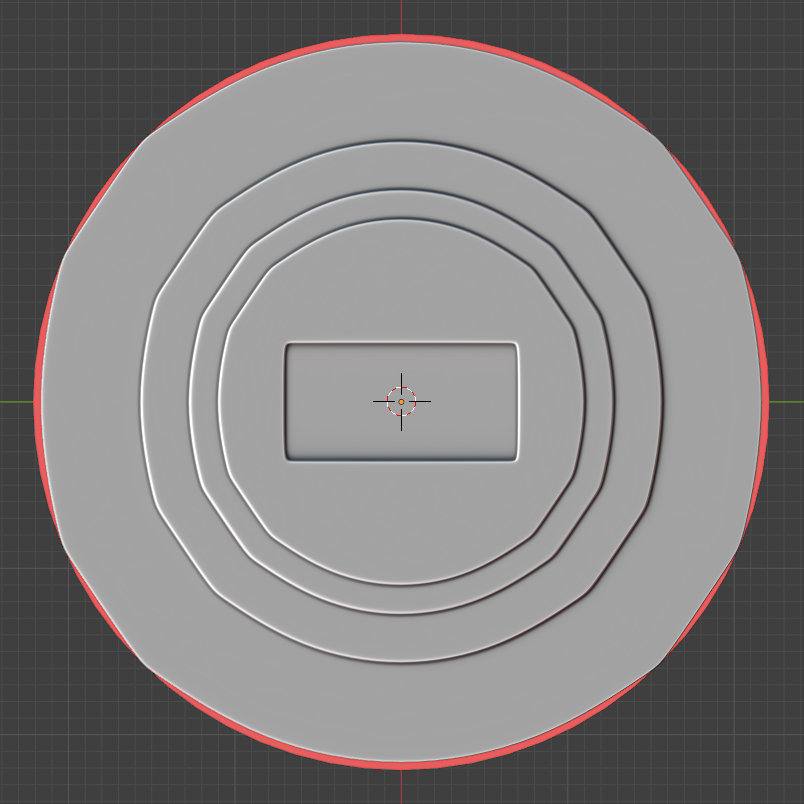
	
## Przekierowywanie pętli
### Zaburzona gęstość geometrii
!!! question "Dlaczego nie mogę wykonać poprzedniego zadania?"
	Referencja składała się z samych prostych prymitywów. W przeciwieństwie do kieliszka nie byliśmy jednak w stanie zamodelować obiektywu. Dlaczego?
	
Subdivision zaokrągliło nasz kwadratowy otwór. W trakcie modelowania należało więc dodać wokół niego holding edges. Te zaś wyszły do całej reszty modelu i wyostrzyły krawędzie, które miały być zaokrąglone, co skutkowało zaobserwowanymi wcześniej artefaktami. To jest - zaburzyliśmy równomierną gęstość geometrii na zaokrąglonych powierzchniach.

!!! question "Co mam w tej sytuacji zrobić?"
	Jak mogę użyć holding edges, aby nie wyszły one w złe miejsca?

### Gdzie kierują się pętle?
Gdy przecinamy krawędź za pomocą loop cut pętla trafia do krawędzi przed nią. Ale gdzie dokładnie jest kierunek w przód?

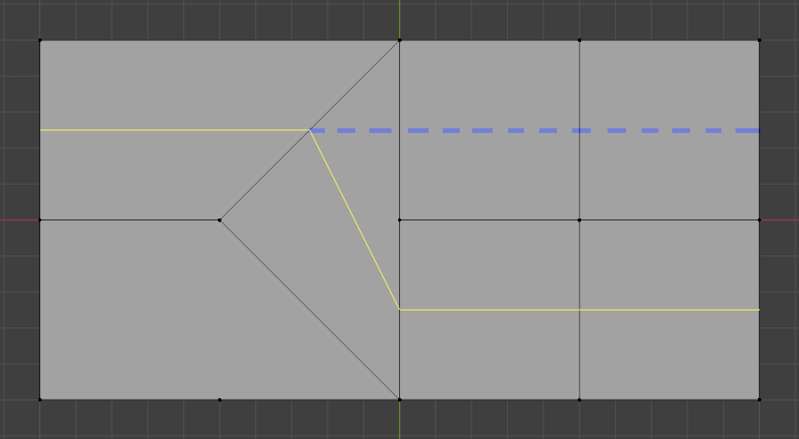

!!! note "Podejrzana ściana"
	Na zdjęciu widnieje ściana o kształcie trójkąta, przez które loop cut nie przechodzi. Zauważ jednak, że ta ściana nadal jest quadem - ma cztery wierzchołki.

Intuicja podpowiada, że pętla powinna przejść do krawędzi prosto przed nią (zaznaczona na niebiesko). Nie jest to jednak rozwiąniem stabilnym - samo przesuwanie wierzchołków po meshu mogłoby wtedy zmienić edge flow. Wobec tego pętla przechodzi do krawędzi, która z nią nie sąsiaduje (zaznaczona na żółto przez loop cut).

Jeżeli pracujemy na quadach, to każda wybrana krawędź ma tylko jedną, która z nią nie sąsiaduje. Na innych poligonach nie da się jednak w ten sposób zdefiniować przodu - w trójkącie wszystkie krawędzie ze sobą sąsiadują, a w wielokątach powyżej czterech krawędzi każda krawędź ma wiele kandydatów na przód, więc nie wiadomo który wybrać. **Jest to powodem dla którego n-gony przerywają pętle**. W analogiczny sposób działa przerywanie pętli przez bieguny.

!!! note "Przerywanie pętli przez n-gony i bieguny"
	N-gony i edge poles przerywają pętle ścian i krawędzi, ponieważ dla danej krawędzi nie wiadomo która jest przed nią.

### Jak przekierować pętlę?
Spróbujmy przekierować na poniższym przykładzie pętlę tak, aby przebiegała według pożądanego kierunku zaznaczonego na niebiesko.

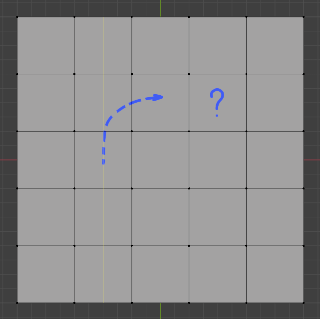

Musimy gdzieś dodać nową przednią ścianę. Dodamy ją tam, gdzie pętla ma skręcać za pomocą knife tool.

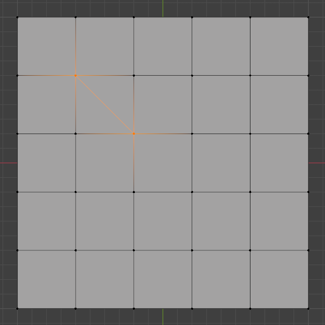

Zauważ, że utworzyliśmy w ten sposób trójkąty które przerywają pętlę ścian. Musimy naprawić topologię - zrobimy to poprzez usunięcie sąsiednich krawędzi.

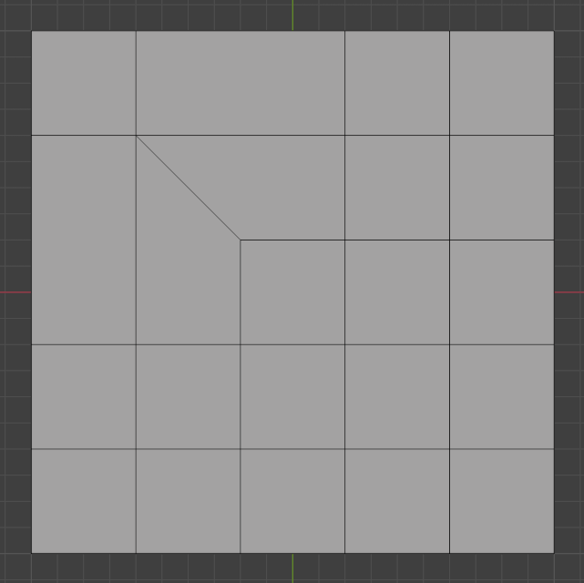

Przekierowaliśmy pętlę. Zauważ, że powstały przy tym nowe bieguny (czerwony i niebieski)

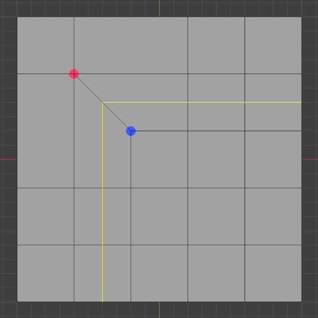

Z powyższego przykładu wynika kilka ciekawych faktów:

!!! note "Przekierowanie pętli redukuje gęstość geometrii"
	Przekierowanie przez nas pętli wymagało usunięcia części istniejącej geometrii. Przekierowując pętle możemy redukować więc gęstość geometrii.

!!! note "Bieguny sterują przebiegiem pętli"
	Nie można przekierować pętli bez utworzenia nowych biegunów. Bieguny są kluczowe do sterowania ich przebiegiem.

!!! note "Bieguny chodzą parami"
	Każdy biegun piątego stopnia posiada swoją parę - biegun trzeciego stopnia.

!!! example "Zadanie 7"
	Otwórz płaszczyznę. Przetnij ją pięć razy pionowo i poziomo. Następnie przekieruj pętle tak, aby uzyskać edge flow jak na referencjach:
	
	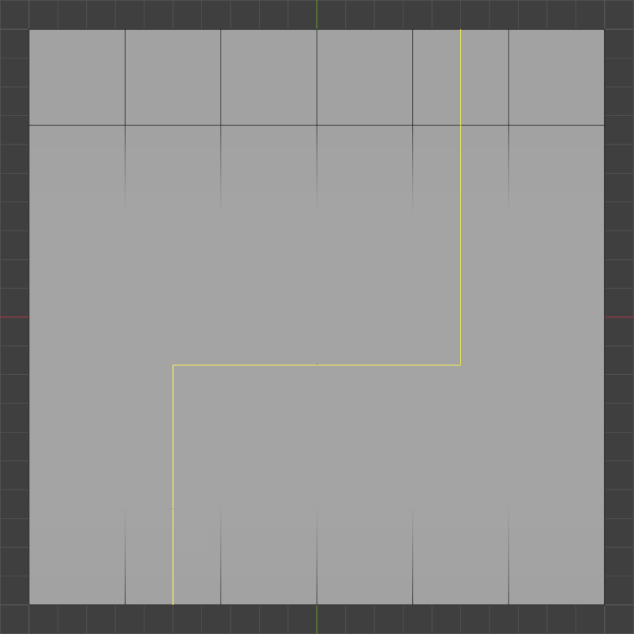

	

	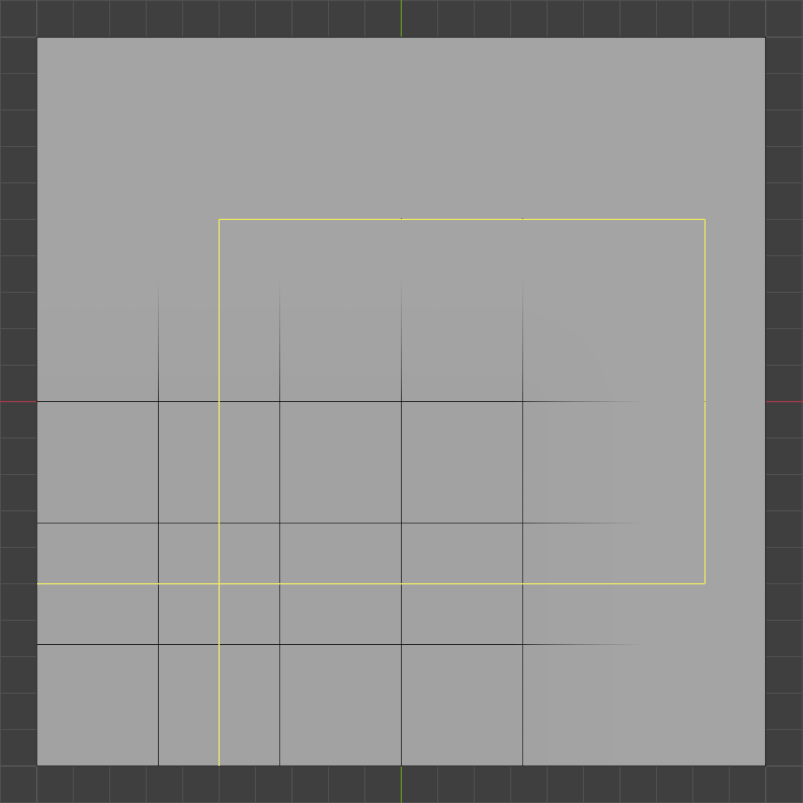

### Przekierowanie pętli w praktyce
Spróbujmy zamodelować kwadratowe wcięcie na sferze.

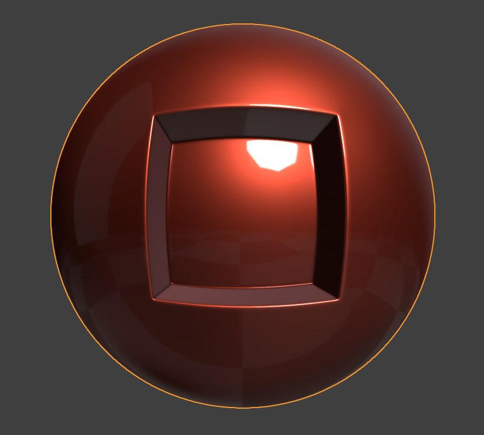

Dodajmy na scenę nową Quad Sphere. Wytnijmy w niej kwadratowy otwór i wyrównajmy w nim gęstość geometrii

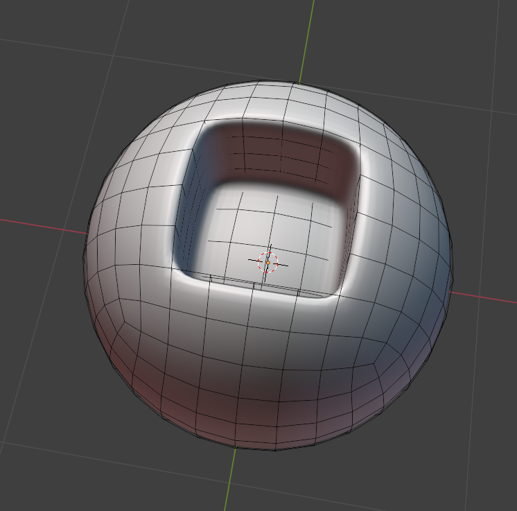

Dodajmy holding edges. Tak jak poprzednio na naszym modelu pojawiły się artefakty związane z niewyrównaną gęstością geometrii.

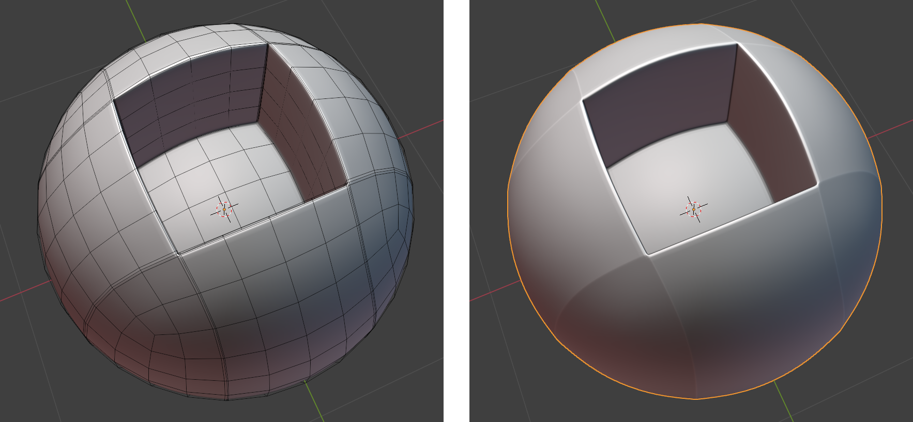

Wiemy już jednak, że przekierowanie pętli pozwala nam zredukować nadmierną gęstość geometrii. Spróbujmy więc przekierować któryś holding edge.

W ramach pierwszej próby spróbujmy przekierować czerwoną pętlę poniżej, według niebieskiej strzałki. Łącząc obie te pętle powinniśmy finalnie móc zredukować geometrię.

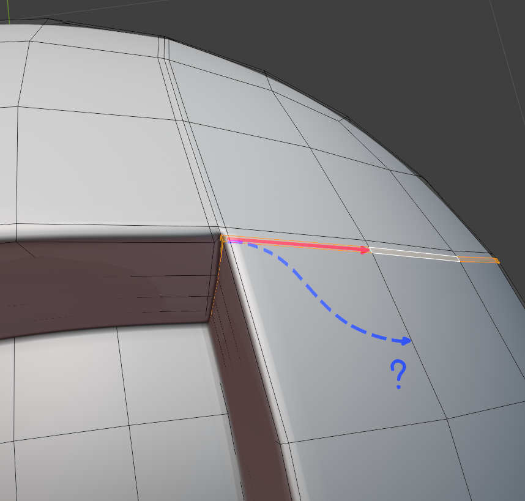

Możemy to uzyskać np. wykonując merge wierzchołków.

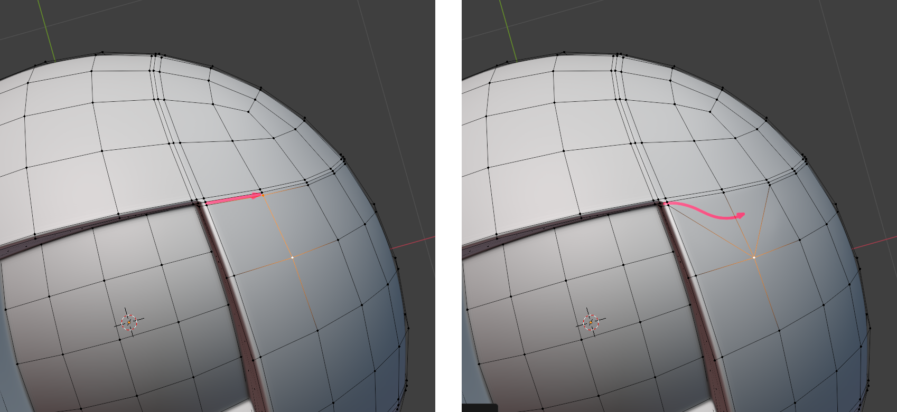

Merge stworzył nowy biegun, który przerwał pętlę tworzącą nasz holding edge. Możemy teraz usunąć jej pozostałą część.

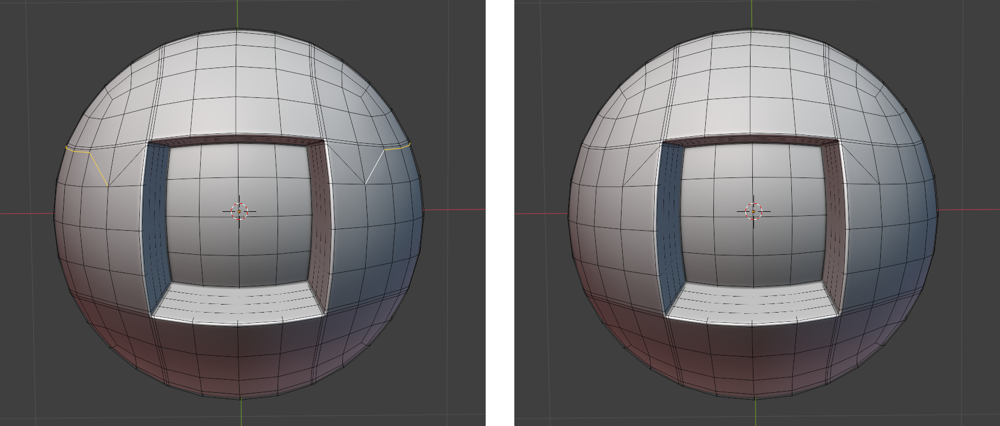

!!! tip "Usuwanie pozostałości pętli za pomocą dissolve"
	Przerywanie pętli z obu stron za pomocą merge pozwala nam na szybkie usunięcie jej niechcianej części za pomocą narzedzia dissolve.

Jest problem - utworzyliśmy dwa trójkąty jako efekt uboczny. Możemy próbować je jakoś zamienić na quady dodając między nimi jakąś pętlę, lecz zmienimy w ten sposób krzywiznę kuli. Spróbujmy więc przekierować inną pętlę.

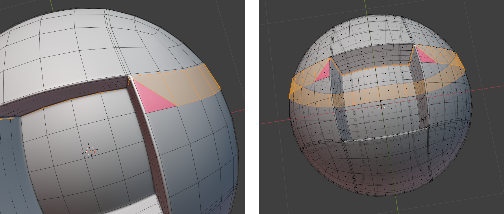

!!! tip "Złe przekierowanie"
	W trakcie modelowania mimo planowania możemy i tak źle przekierować pętle. Nie należy się poddawać - trzeba spróbować gdzie indziej. Kluczowe jest w tym celu częste zapisywanie projektu i posiadanie ustawionej wysokiej ilości dostępnych cofnięć.
	
!!! tip "Nie zmuszaj złego rozwiązania do działania"
	Lepiej zacząć od nowa niż robić coś źle już na starcie. Zmuszając złe rozwiązania do działania zostawiamy sobie tylko więcej problemów na przyszłość. Oczywiście nie zawsze wiemy, że coś co robimy jest złe. Da się z takich sytuacji wyjść, ale jeżeli wiemy że istnieje lepsze rozwiązanie warto przejść do niego od razu.
	
Jeżeli nie udało się przekierować pętli na dole to spróbujmy przekierować tą na górze (zaznaczona na czerwono). Ponownie - gdy wykonamy merge pojawi się trójkąt.

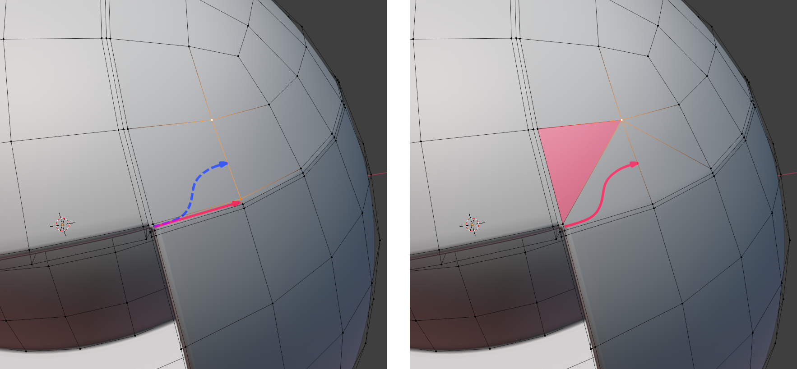

Zauważ jednak, że po lewej od tego trójkąta jest kolejna pętla do przekierowania. Jeżeli przekierujemy ją w kierunku tego trójkąta to on zniknie!

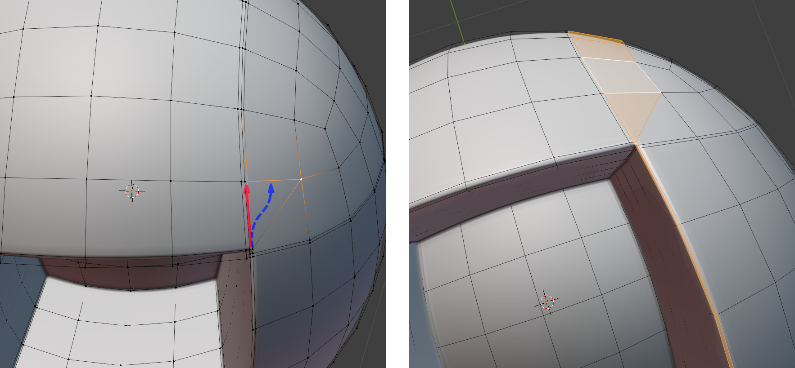

Jeżeli powtórzymy te operacje dla każdego wierzchołka to utworzymy nie tylko nowe pętle od przekierowanych holding edges - pojawi się również pętla wokół samego otworu.

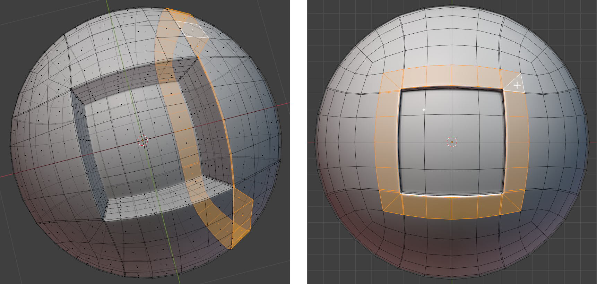

Pozostałe holding edges przekierujemy w analogiczny sposób.

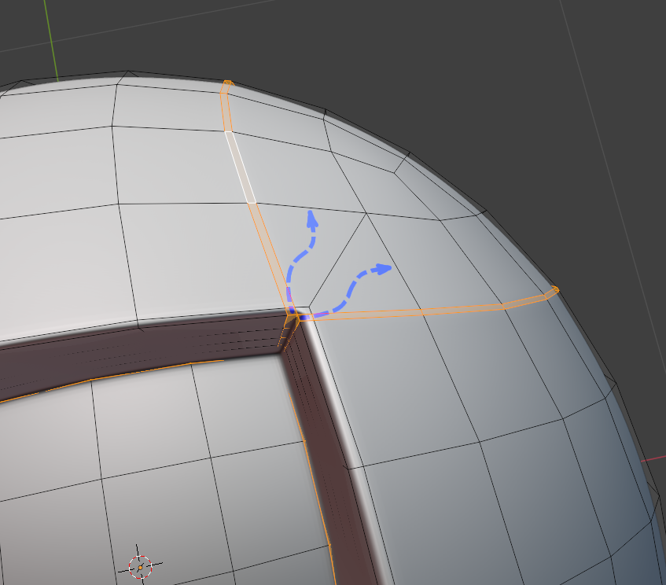

Gdy przekierowujemy holding edges należy się upewnić że przekierowujemy faktycznie holding edge a nie oryginalną pętlę geometrii danego obiektu. W przeciwnym wypadku zmienimy jego krzywiznę.

Na obrazku po lewej kolorem żółtym zostały zaznaczone oryginalne pętle Quad Sphere. Wiemy że są poprawne, bo podtrzymują one wierzchołek kwadratowego wcięcia i nie przechodzą dalej tak jak pętle utrzymujęce.

Pętle na zewnątrz od nich to holding edges. Żeby nie mieszało nam się dalej zostaną one od razu zmergowane z oryginalnymi pętlami quad sphere. Przerwie to ich dalszy przepływ.

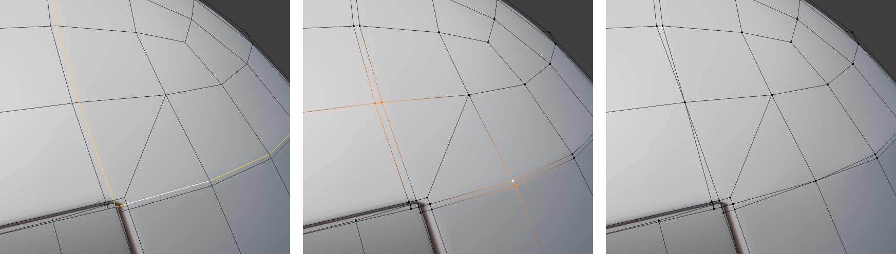

Jeżeli spojrzymy się z bliska na utworzoną siatkę zobaczymy, że czerwone krawędzie służą tylko do podtrzymania wierzchołków zaznaczonych na czerwono. Jeżeli je złączymy do niebieskiego wierzchołka to będziemy mogli pozbyć się tych krawędzi.

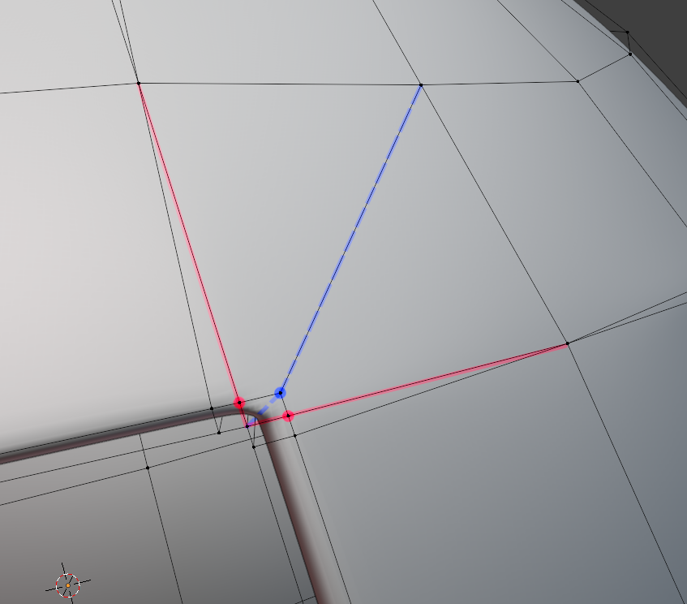

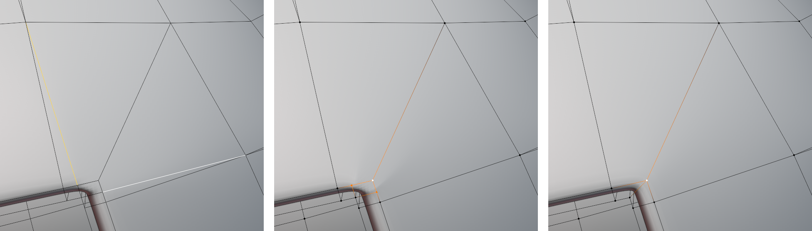

Po powtórzeniu tej operacji dla każdego wierzchołka pozostanie nam tylko pozbyć się pozostałości po przekierowanych holding edges.

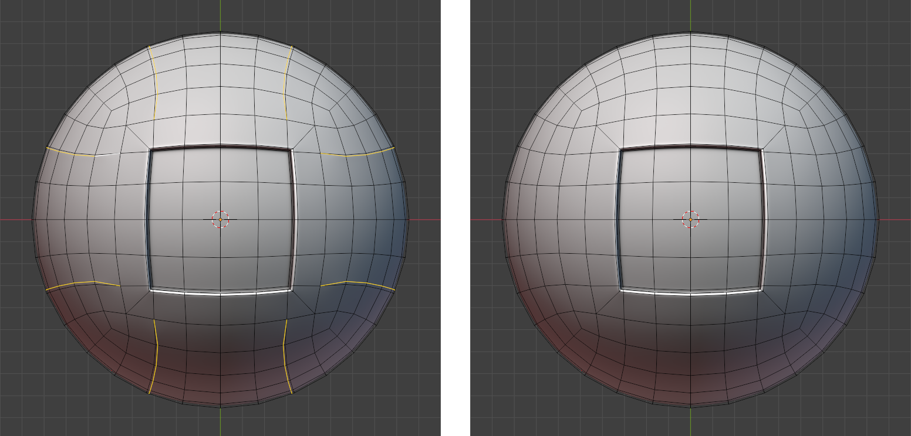

Nasz mesh jest gotowy. Zauważ, że przekierowanie odbyło się kosztem wprowadzenia nowych biegunów.

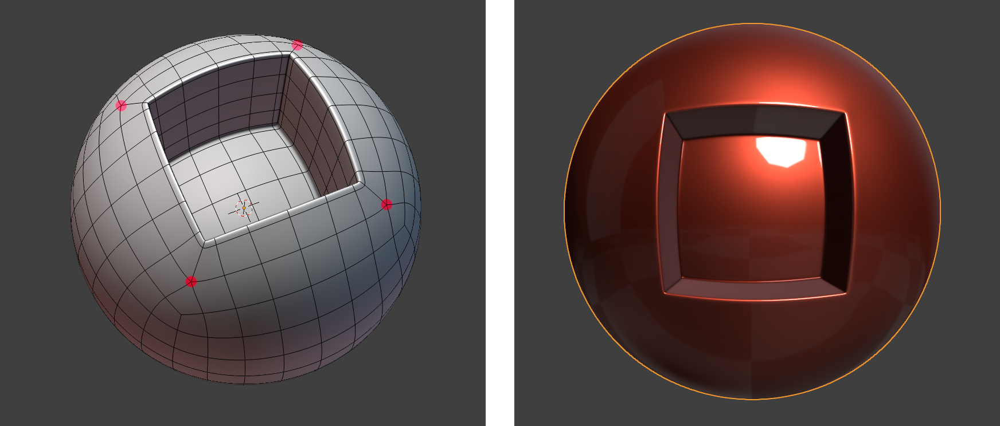

!!! example "Praca domowa"
	Na podstawie zdobytej w tym dziale wiedzy dokończ model aparatu.
