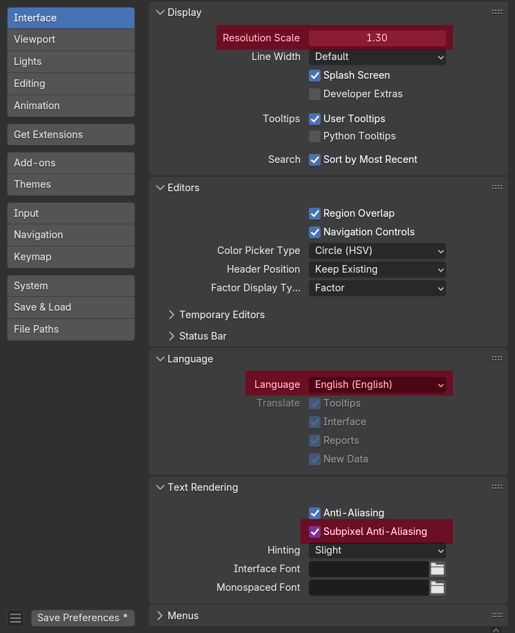
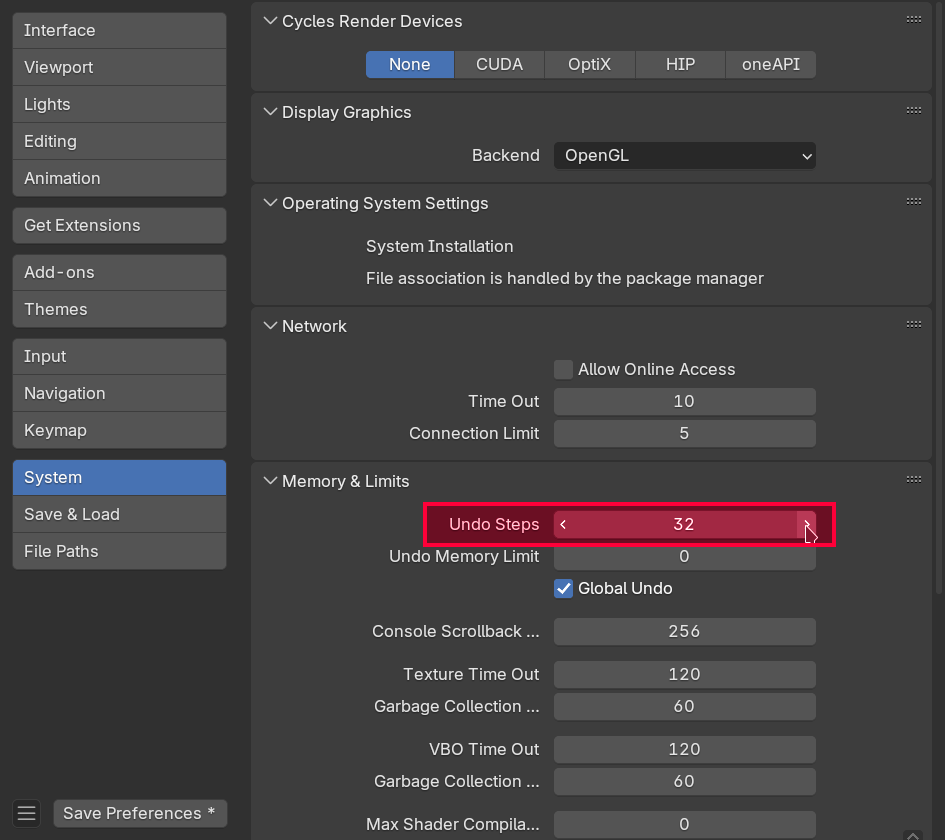
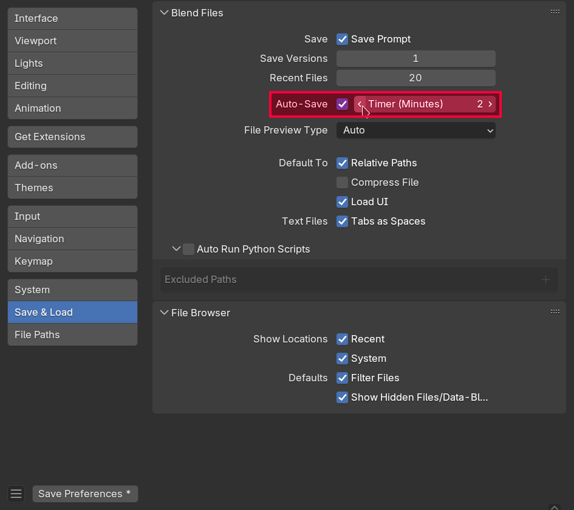
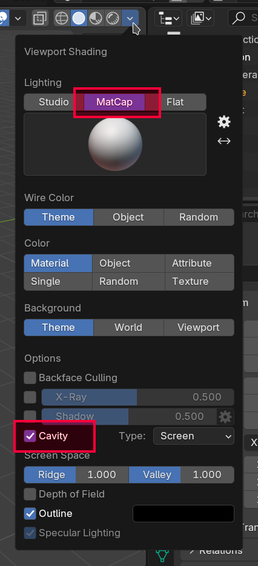
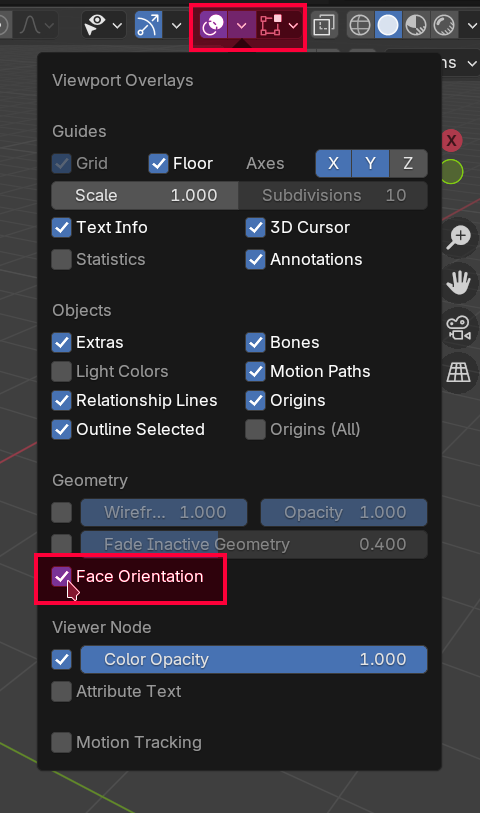

# Konfiguracja Blendera

!!! note "O tej sekcji"
    Ta sekcja jest przeznaczona dla osób, które nie wykonują kursu po kolei bądź chcą skrót konfiguracji która się odbyła na poprzednich zajęciach. Możesz pominąć tą sekcję jeżeli planujesz przejść przez kurs po kolei.

## Interfejs użytkownika
Przed rozpoczęciem warto skonfigurować Blender tak, aby jak najmniej przeszkadzał nam w naszej pracy. Z menu na samej górze programu wybierz `Edit` - `Preferences`. 

Przede wszystkim:

- zmień rozmiar UI jeżeli tego potrzebujesz
- **koniecznie** ustaw język na angielski jeżeli tak nie jest!
- poeksperymentuj z opcjami anti-aliasingu i hintingu dla bardziej czytelnego tekstu

Polska wersja językowa nie tylko nie jest dokończona, w niektórych miejscach jest po prostu błędna. Ponadto - wersja angielska jest uniwersalnym standardem. Korzystanie z wersji polskiej utrudni korzystanie z różnorodnych materiałów w sieci oraz paradoksalnie utrudni porozumiewanie się z innymi użytkownikami Blendera w Polsce.

## Auto-depth
Czasami w trakcie modelowania można zauważyć, że przybliżanie kamery do obiektów w pewnym momencie spowalnia. Jeżeli będziemy próbować dalej przybliżać mimo tego dojdzie do sytuacji, w której ruch kamery się zatrzyma a my będziemy musieli tyle samo cofać, żeby przywrócić kamerę do poprzedniej pozycji (bądź wcisnąć klawisz `.`). Powoduje to wrażenie zawieszenia się programu, podczas kiedy jest to wbudowane zachowanie które można wyłączyć.

Aby je wyłączyć należy wejść w `Edit` - `Preferences` - `Navigation` i zaznaczyć `Auto Depth`.

<video controls>
<source src="../../assets/vid/blockout/auto-depth.webm" type="video/mp4">
</video>

## Konfiguracja do długotrwałej pracy
### Ilość cofnięć
W trakcie modelowania zależy nam na jak największej elastyczności. Będziemy polegać w dużej mierze na operacji cofania. Domyślny limit 32 cofnięć szybko okaże się niewystarczający. Można go zwiększyć w menu `Edit` - `Preferences` - `System` - `Undo Steps`. Ustaw ilość na 256.

!!! warning "Uwaga!"
	Ilość dostępnych cofnięć wpływa na zużycie pamięci RAM

### Autosave
Blender automatycznie zapisuje twoje postępy co dwie minuty. Warto zmniejszyć odstęp zapisywania do minuty aby ograniczyć szkody w wypadku nagłego crashu programu.

## Viewport Shading
Ponieważ będziemy pracować przez większość czasu w obszarze 3D Viewport warto zmienić cieniowanie na bardziej wyraźne.

!!! tip "MatCap vs Studio Lighting"
	W przeciwieństwie do oświetlenia typu MatCap, **Studio Lighting (domyślne oświetlenie) nie pokazuje nam problemów z cieniowaniem!**

W zakładce Viewport Shading wybierz MatCap a następnie zaznacz taki, który ci najbardziej odpowiada (polecam `clay_studio.exr`, nazwa MatCapu jest widoczna po najechaniu na niego myszką i poczekaniu na dymek). Zaznacz również opcję "Cavity" która sprawia, że kontury twojego modelu będą posiadały wyraźniejszy obrys.

## Odwrócone normalne
Istnieje sporo sytuacji, w których możemy się natknąć na tzw. "odwrócone normalne". Powodują one odwrócone cieniowania (oświetlone ściany stają się ciemne, ściany w cieniu stają się jasne).

Aby sprawdzić obecność odwróconych ścian należy włączyć odpowiedni overlay we viewportcie klikając w `Viewport Overlays` - `Face Orientation`.

Jeżeli nasz mesh nie posiada odwróconych normalnych to nic się nie zmieni. W przeciwnym wypadku złe ściany zostaną zaznaczone na czerwono.

!!! tip "Face Orientation Overlay"
    Od tej pory warto mieć ten overlay zawsze włączony - będziemy dzięki niemu natychmiast wiedzieć kiedy natrafiliśmy się na odwrócone normalne.
